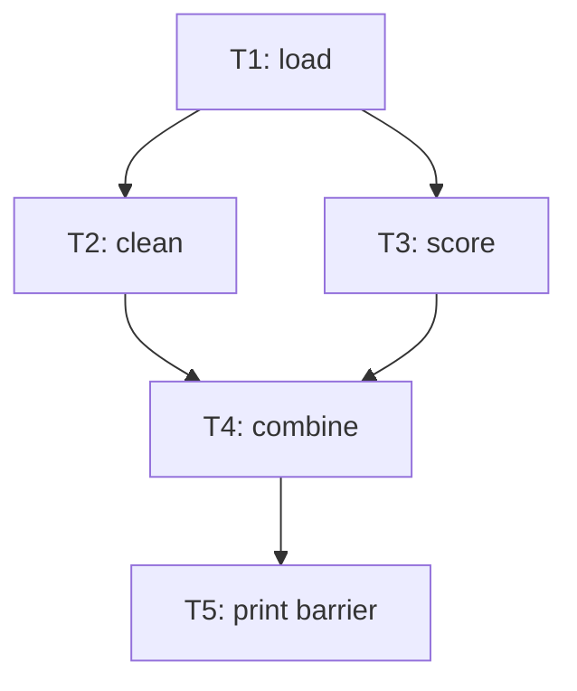
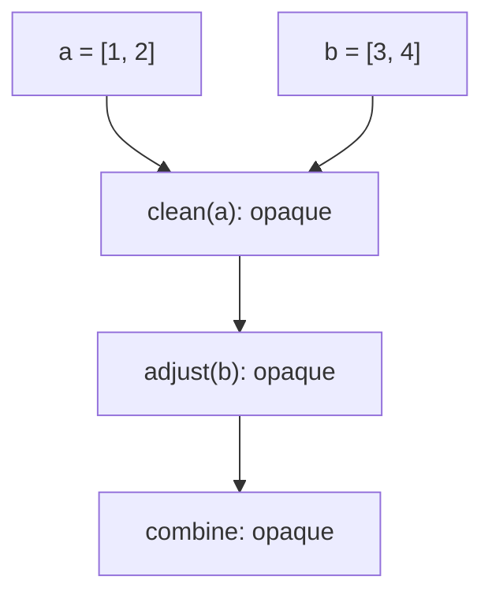
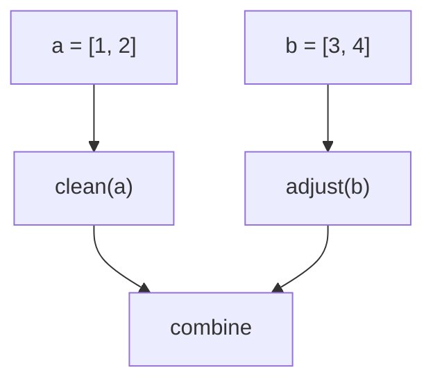

# A conservative static DAG engine for a Python runtime

## 1. Purpose and scope

This implementation turns one Python module's source into an inspectable graph
of computations, logical values, and ordering requirements. It is intended to
sit between parsing and a future runtime's placement/dispatch layer. It does
not execute the input program. In particular, analysis never calls a function
from the input, imports its dependencies, or evaluates its expressions.

The guiding invariant is:

> Permit an ordering freedom only when the bounded analysis proves it within
> the stated execution contract. Otherwise preserve order and explain why.

This is an implementation with a tested, deliberately small proof domain. It is
not a general Python compiler, whole-project effect analyzer, or formal proof
of all Python semantics. Arbitrary Python cannot always be automatically
parallelized. Many perfectly valid programs will produce mostly serial graphs.
That is an intentional outcome when this analyzer cannot establish safety.

The precision revision originally shipped with 272 pytest cases. The suite reached
275 after three final mixed soundness/torture tests, reached 288 after bounded
local-control-flow and explicit `@task` coverage, and now contains **294** DAG
tests after the Collatz/floor-division precision pass.
Original prototype examples, an automatically proved diamond, and a reproducible
analysis benchmark are retained. All 152 baseline cases remain; four expectations
of unnecessary serialization were revised with explicit reasons.
Section 20 documents the changes and their soundness audit.
The implementation was tested with Python 3.12.14 and pytest 9.1.1. Other Python
minor versions have not been validated. The host parser determines the accepted
grammar; newly encountered AST constructs default to opaque treatment.

## 2. What was inspected and what was replaced

The supplied `ast_test(1).zip` contains six Python files:

| Original file | Assessment | Treatment |
| --- | --- | --- |
| `ast_peek.py` | Small `ast.dump` experiment | Inspected; no reusable runtime abstraction |
| `inspect_ast.py` | Top-level call/assignment inspection experiment | Inspected; replaced by structured lexical analysis |
| `build_dag.py` | Prototype task discovery and final `producer_of` map | Architecture replaced |
| `scheduler_sim.py` | Prototype discovery plus fabricated task durations and worker simulation | Inspected; excluded from this subsystem |
| `program.py` | Useful example pipeline | Preserved as `examples/prototype_program.py` |
| `program2.py` | Larger useful example pipeline | Preserved as `examples/prototype_program2.py` |

The most serious original issue is that it collects assignments first and
retains only the last producer of each variable name. With `x=load();
x=clean(x)`, the second assignment can appear to read itself. Earlier consumers
can also be connected to a later assignment. Merely adding another pass to that
map would not solve versioning, aliases, effects, or control flow.

The prototypes also miss keyword dependencies, ordinary expressions, complex
targets, and most statements. Their scheduling simulations are useful learning
experiments, but execution and timing do not belong in this analysis component.

The new implementation is separate from those scripts. No original experiment
is imported by the engine.

## 3. Architecture and public interface

There are three reusable engine modules and one optional tool:

| Module | Responsibilities |
| --- | --- |
| `dag_engine.py` | Public facade, source spans, source-order analysis, values/bindings, barriers, CLI |
| `dag_model.py` | Graph records, immutable indexes, graph validation, topology, explanation queries, readiness state |
| `dag_static.py` | Lexical name facts, static characteristics, bounded exact-type proofs and local function summaries |
| `dag_visualizer.py` | Consumes a DAG; emits DOT and optionally invokes `dot` |

`dag_model.py` is independent of the analyzer. `dag_static.py` uses the model's
descriptive characteristic record. `dag_engine.py` combines them. Neither the
model nor analyzer imports the visualizer. Keep the three engine modules
together; importing `dag_engine` is the runtime's public entry point.

```python
from dag_runtime.dag_engine import analyze_source, analyze_file, AnalysisOptions

dag = analyze_source(source, filename="pipeline.py")
dag = analyze_file("pipeline.py")

dag.validate()
order = dag.topological_order()
roots = dag.initial_ready_tasks()
leaves = dag.sinks()
```

The public facade also exports the record types, enums, graph/readiness errors,
and `ReadinessState`. The graph can be converted to JSON-compatible records
with `dag.to_dict()`. JSON has an explicit `schema_version`; loading arbitrary
JSON into executable code is not implemented.

The analyzer parses the module and calls `compile` to validate its scope rules;
it discards the resulting code object without executing it. This additional
check matters because parsing alone does not perform all compiler scope checks.
For example, a module-level `return` can parse but cannot compile as a module.
See Python's [AST documentation](https://docs.python.org/3/library/ast.html#ast.parse).

## 4. Assumptions and the execution contract

The assumptions are also stored in `dag.assumptions`. They are a boundary of the
analysis, not facts inferred about an arbitrary running application:

1. Analysis starts with a fresh, ordinary module namespace and standard
   builtins. This API does not inspect an existing notebook kernel, REPL,
   monkeypatched process, or application globals dictionary.
2. The type proof uses exact built-in types established from the source and
   bounded local function analysis. Type annotations do not establish those
   facts. An arbitrary object is not treated as an integer because a parameter
   is annotated `int`.
3. Resource exhaustion, asynchronous signals, tracing/debugging observations,
   and similar execution-environment observations are outside the parallel
   proof. Even allocating a literal can fail in a resource-exhausted process.
4. User-created concurrency must not mutate state across distributed task
   boundaries. Explicit async/generator/concurrency syntax triggers a native
   module fallback. Concurrency hidden inside external code is not discovered;
   such code requires the future runtime to retain native scope execution.
5. Logical values must keep their binding version. The runtime must preserve
   source-order namespace commits, alias identity, ordinary exceptions, and the
   state required by opaque operations.
6. A shared namespace token is an execution-context requirement, not a
   serializable copy of every Python object. The analyzer does not implement
   transport, isolation, or serialization.

These rules are essential. Consider independent value computations around a
rebinding. It is safe to compute them with explicit versioned inputs; it is not
safe to run their original statements concurrently against the same mutable
`globals()` dictionary. The eventual execution adapter must distinguish
computation from the source-order binding commits recorded in `BindingEvent`.

`TaskNode.source` is retained source evidence, **not a ready-made worker RPC or
an independently executable lowering**. Preserving future-import settings,
definition identity, binding order, and native region context remains the
execution adapter's responsibility. For an opaque scope that cannot be lowered
while preserving these requirements, the safe execution route is the original
source in one native Python context.

This distinction is especially important for object lifetimes. An unknown
object's logical value record must not automatically cause the scheduler to
retain a new strong Python reference or serialize a copy: that could change
finalization or alias behavior. `storage="native_namespace"` describes a
native lookup/view, not an instruction to capture an arbitrary object by value.

`execution_permitted=True` means the source passed parser/compiler checks and
has an execution representation under this contract. It does not mean every
node can run remotely, that required data already exists on a worker, or that
the program will finish successfully.

## 5. What a DAG means here

A directed acyclic graph expresses a partial order. An edge `A → B` means that
successful completion of A is a prerequisite for B. It may exist because B
reads A's output or because an uncertain effect must preserve order. The graph
has no directed cycle, so there is always a topological ordering when nonempty.

The graph is not the program's control-flow graph. It does not represent a
loop's next iteration by an edge back to an earlier task. A loop is one bounded
static region whose internal execution remains Python's responsibility.

Absence of a **direct** edge does not imply independence. There may be a path
through other tasks. `dependency_path` checks this; `explain_parallelism` checks
both path directions and both nodes' certainty before describing an allowed
ordering freedom. Placement and input availability are additional conditions.

### Task nodes

A task is one computation occurrence, not a function definition or function
name. `a=f(); b=f()` produces different task IDs, even when both refer to the
same callable. IDs are deterministic sequence IDs such as `T000001`. They are
stable for identical source/options, not persistent identities across edits;
inserting an earlier task can renumber later IDs.

Each frozen `TaskNode` contains its ID, kind, label, callable representation
where available, source span/text, AST type, input/output value IDs,
dependencies/dependents, certainty, conservative reasons, proof description,
static characteristics, placement requirement, and runnable flag. Revision 2
also records effect scope, namespace epoch, mutated object IDs, region scope,
and the number of direct statements retained inside a region.

### Values

`Value` describes a logical value or namespace view. Its ID, such as `V000007`,
is distinct from its display label, such as `users#2`. Records include the
producer, origin, type hint, known reference group, alias source, unpacking
projection, possible unbound state, optional callable definition ID, and storage
classification.

The origins distinguish results, aliases, definitions, builtins, external
lookups, namespace projections, namespace/completion tokens, and object-state
tokens. Literal arguments
are present in the task source; they are not fake producer tasks or external
input values.

### Edges

`DependencyEdge` represents one `(source, target)` pair and contains one or more
`EdgeReason` records:

| Kind | Meaning |
| --- | --- |
| `DATA` | The target reads a specific logical value produced by the source |
| `STATE` | The target requires the namespace/object-state view supplied by the source |
| `ORDER` | A conservative effect or completion barrier preserves prior execution order |

One pair can carry several data reasons and an ordering reason. Readiness counts
the predecessor once, regardless of the number of reasons.

Certainty is attached to individual reasons as well as nodes. A conservative
consumer can still have an exact data edge: uncertainty about the consumer's
effects does not invalidate an established producer/consumer relationship.

## 6. Source-to-graph construction

The analysis proceeds in source order:

1. Parse and compiler-check the complete module without running it.
2. Apply AST-size and native-context guards.
3. Record plain function definitions as definition artifacts and bindings.
4. Collect lexical reads, writes, captures, and calls for each statement.
5. Resolve reads against the current versioned environment.
6. Attempt the bounded proof of the statement's computation and target behavior.
7. Create a certain computation or a conservative region/barrier.
8. Add data/state edges and any ordering edges, then publish new value versions.
9. Resolve final named views, freeze graph records, and validate all indexes and
   topology.

Python's documented evaluation order is relevant here: assignment evaluates
its right-hand side before performing target assignments, and expression
evaluation has specified ordering rules. The engine preserves the containing
statement rather than flattening arbitrary subexpressions into independently
scheduled calls. See [evaluation order](https://docs.python.org/3/reference/expressions.html#evaluation-order).

### One statement, including nested calls

For this version, `result=combine(clean(a), analyze(b))` is **one task**, with
inputs that include `a`, `b`, and relevant callable values. The source retains
the nested calls and their evaluation order. The analyzer may prove this whole
computation effect-free if all those local calls pass its bounded rules, but it
does not expose `clean` and `analyze` as separate distributed tasks.

This choice also prevents incorrect eager expansion of `False and write_file()`
or the unselected branch of a conditional expression. Dynamic argument
expansion, short-circuiting, descriptor access, and expression-local assignment
remain inside the native statement when unproved.

For `b=a+10`, there is an ordinary expression task. The runtime does not need a
second, implicit local-expression interpreter to reconstruct dependencies
between calls. Constants embedded in the expression create no additional tasks.

## 7. Versioning, aliases, and projections

The environment maps a name to a binding record containing a value ID, an
abstract type fact, and an analysis epoch. The version counter is separate from
that environment. Reading a name resolves the value visible **at that point**;
writing it creates a new version.

For a proved local `step` function:

```python
x = 1
x = step(x)
x = step(x)
result = step(x)
```

| Statement | Reads | Publishes | Required predecessor |
| --- | --- | --- | --- |
| `x=1` | Literal only | `x#1` | None |
| First `x=step(x)` | `x#1`, definition of `step` | `x#2` | First task |
| Second `x=step(x)` | `x#2`, definition of `step` | `x#3` | Second task |
| `result=step(x)` | `x#3`, definition of `step` | `result#1` | Third task |

Opaque computations use the same version system, but their outputs may be
namespace views instead of proved value snapshots. That distinction prevents
later code from trusting stale types or definite-binding claims after arbitrary
effects.

### Aliases

With proved bindings:

```python
def load():
    return [1, 2]

a = load()
b = a
c = process(b)
```

`b=a` creates `b#1`, an alias of `a#1`, without a computation task. Both values
share the established reference group and producer. A `BindingEvent` retains
the source-order binding operation. `process` consumes the alias value; its
producer is still the load task.

Rebinding `a` later does not change `b`'s old version. For immutable proved
values, `x=1; b=x; x=2; c=b+3` connects `c` to the first assignment only.

Alias elision is conditional. After unknown code has run, it may already have
introduced the alias target into the namespace. Rebinding that target could
release an object with finalization effects. The input lookup may also be
unbound. Those cases get an explicit opaque binding region rather than an
unjustified zero-cost alias.

Equal `object_id` values assert an established shared reference group. Unequal
IDs do **not** prove two heap objects cannot alias. For example, an ordinary
function can return one of its arguments. There is no complete points-to
analysis. The narrowly indexed exception is an exact flat list whose fresh
allocation was proved: direct aliases share its object state, and a possible
unindexed alias disables object-local mutation. Only that extra allocation and
escape proof permits unrelated mutation branches (section 20).

### Unpacking and multiple targets

One statement owns its entire RHS, target assignment sequence, and unpacking.
For a proved tuple return, `x,y=split(data)` produces two value records with
projections `(0,)` and `(1,)`, both produced by the split task. There are no fake
second calls to `split`.

Nested known tuple/list shapes and starred rest targets are represented. A
starred rest has a list type and a projection such as `("2:*",)`. Projections
are descriptive records; a future adapter must implement actual Python
unpacking behavior, not blindly treat every projection as a dictionary key.

Unknown lengths or iteration protocols become opaque. So do target setters and
unproved rebinding finalizers: a later target's callback can change an earlier
target in the same statement. Those named outputs are conditional namespace
views. Repeated targets, such as `x,x=(1,2)`, receive successive versions, with
the final mapping selecting the last binding.

## 8. The exact proof subset

The proof is an abstract computation over `TypeFact`, not evaluation of concrete
Python values. It never runs `eval`, executes a user function, or guesses purity
from a function's name.

The following table is intentionally precise:

| Construct | Proved behavior in this version |
| --- | --- |
| Constants | `None`, `bool`, `int`, `float`, `complex`, `str`, `bytes` |
| Name read | Reference to a currently established, definitely bound value |
| Lists/tuples | Construction without starred expansion; input expressions must pass |
| Dicts/sets | Construction with exact scalar keys/elements, no mapping expansion; constituent expressions must pass |
| Arithmetic | `+`, `-`, `*` on exact integer/bool operands, or two exact floats |
| Unary arithmetic | Unary `+`, `-` on exact integers/bools; `~` on exact integers |
| Logical negation | `not` on known passive built-in data |
| Comparison | `==`, `!=`, `<`, `<=`, `>`, `>=` between exact integers/bools |
| Builtin `len` | One positional exact built-in container/string/bytes argument |
| Builtin `sum` | One positional exact list/tuple whose elements are proved integers/bools, including a proved empty sequence |
| Builtin `abs` | One positional exact integer/bool argument |
| Builtin `min` / `max` | One or more exact integer/bool arguments in bounded local-function proof |
| Builtin `range` | One to three exact integer/bool arguments; a supplied step must be proved nonzero |
| Local function calls | Bounded local control flow (`if`/`for`/`while`), local-name assignment/`+=`/`-=`/`*=`, supported expressions, validated argument binding |
| Target unpacking | Known tuple/list shape with compatible length; nested and starred targets supported |
| Subscription | Exact list/tuple with retained shape, valid literal signed integer/bool index, immutable selected result |
| List comprehension | One synchronous generator and simple target, exact homogeneous immutable iteration elements, pure/total immutable body and filters |
| List mutation | Atomic `a.append(value)` on an indexed fresh exact list, immutable contents/argument, no untracked escape |

Everything outside these rules becomes conservative. Examples include division,
power, mixed int/float arithmetic, general string operations, attributes,
general subscriptions, f-strings, short-circuit expressions, and identity comparisons.
Some are safe for particular inputs, but that proof is deliberately not
implemented. Exact integer `/` retains the historical completion-fence treatment. Exact integer `//` also keeps that treatment except for the deliberately narrow case of a non-zero integer literal divisor (for example `x // 2`), which is total for exact built-in integers. `%` remains conservative unless the bounded local-function proof establishes that the divisor excludes zero; that narrow interval fact is used for realistic numeric loops such as primality tests. None of these operations by itself invalidates namespace facts.
Unknown namespace effects still invalidate exact-type knowledge. Container
allocation after such effects stays conservative because pending GC/finalizer
callbacks cannot be ruled out.

Even apparently innocent operators or attribute reads can dispatch to user
methods. Python's [data model](https://docs.python.org/3/reference/datamodel.html)
documents customization of attribute access, arithmetic, and other protocols.
The engine therefore does not equate syntactically read-only expressions with
effect-free operations.

### Bounded function inspection

A plain function definition is a definition artifact, not an execution of its
body. Definitions retain source and static characteristics even when their
bodies are ineligible for a proof.

A proved body consists of an optional docstring, bounded local control flow and a
final return. The local subset now includes simple-name assignment, numeric
`+=`/`-=`/`*=`, `if`, synchronous `for` over proved `range` or exact immutable
sequences, `while`, `break`, `continue`, and `pass`. Loop bodies are abstractly
revisited with widening so a hazard introduced by a later iteration (for
example a divisor becoming zero) cannot be hidden by proving only iteration one.
The analyzer still creates one atomic call task; it never expands iterations into
DAG nodes.

Expressions inside those bodies must pass the exact-type rules. Global/nonlocal
declarations, mutation through attributes/subscripts/unknown methods, nested
definitions, unknown calls, general side effects, recursion, variadic calling
conventions, and unsupported control constructs remain conservative. Global or
closure reads beyond the supported builtin names (`len`, `sum`, `abs`, `min`,
`max`, `range`) reject automatic proof.

Argument binding supports ordinary positional arguments, positional-only
arguments, keyword-only arguments, keywords, and immutable literal defaults.
Missing, duplicate, unknown, or invalid positional-only keyword arguments cause
conservative treatment. Body parameters and locals correctly shadow builtins,
including when a local assignment appears after an earlier read.

Only one local function body is inspected at a time. A body can use the small
builtin whitelist, but calling another locally defined function from that body
does not initiate recursive interprocedural analysis. Nested source-level calls
in a task's RHS are separately checked as expressions, while remaining in the
same task.

Specializations are cached by function-definition ID, argument type facts, and
builtin availability. No timing, CPU cost, or historical execution data enters
this cache.

### Explicit `@task` contract

The public `dag_runtime.task` decorator is a runtime no-op used as an explicit
analysis contract. The analyzer recognizes it only after the exact runtime import
(or its import alias); name matching alone is never enough. Automatic proof is
still preferred. If a decorated body falls outside the automatic subset, the
programmer declaration may supply the isolation/effect guarantee, and an unknown
result is represented internally as an owned `task_payload` so execution lowering
can keep it transferable. Downstream ordinary Python operations on such an
unknown payload remain conservative unless their type is otherwise proved.

The contract does not authorize hidden global mutation, shared-object mutation,
frame/namespace dependence, or other cross-task side effects. Such behavior is a
contract violation even though the static analyzer intentionally trusts the
explicit declaration.

### Definition-time effects

Defaults, annotations, decorators, and class creation cannot simply be skipped.
In Python, default expressions run when the function is defined; decorators
can execute and replace the function. See
[function definitions](https://docs.python.org/3/reference/compound_stmts.html#function-definitions).

Undecorated synchronous definitions with no annotations/type parameters and
immutable literal defaults qualify as plain setup artifacts. In addition, the
exact runtime marker imported with `from dag_runtime import task` (including an
import alias) is recognized as a no-op definition-time intrinsic. Arbitrary local
decorators merely named `task`, bare unresolved `@task`, decorator calls, and all
other decorators remain opaque. Rebinding the imported marker disables special
treatment.

`@task` is an explicit programmer contract, not an inferred proof: observable
runtime data must flow through arguments/return values, independent calls must
not mutate hidden shared state, and returned values are treated as owned
transferable task payloads when the bounded body proof cannot derive a more
precise type. Violating this contract is user error. Ordinary supported code does
not require the decorator. Stored source still retains decorator lines.

## 9. Read/write hazards, mutation, and barriers

Read-after-write (RAW) means a computation needs a value another computation
produced. That produces a data edge. Write-after-read (WAR) and write-after-write
(WAW) require more care.

For immutable logical values, separate versions remove false storage conflicts:

```python
x = 1
y = x + 1
x = 3
z = x + 1
```

The graph has two chains: first `x → y` and second `x → z`. The second `x` cannot
overwrite the value consumed by `y`, because `y` names `x#1`, not an ambient
variable slot. Source-order binding commits still determine the final `x`.

For shared mutable objects, this argument does not apply:

```python
a = [1, 2]
x = len(a)
y = sum(a)
a.append(3)
```

The two readers may overlap, but the mutation must wait for both. The engine
does not pretend that another SSA name makes the underlying list immutable.
For this proved exact append, it adds object-state WAR edges from the readers,
then publishes a new state token for the same object. Unrelated scalar work or
another fresh object's work need not wait. An unproved mutator still joins the
whole outstanding graph frontier and invalidates the namespace.

### Frontier algorithm

The builder maintains the current graph sinks in an insertion-ordered frontier.
A certain task adds its data/state edges and removes its direct parents from
the frontier. A conservative task adds ordering edges from every frontier node,
clears the frontier, and becomes the new frontier. A proved object-local writer
also includes relevant object readers before updating the frontier; it does not
join unrelated sinks.

Why is joining the frontier sufficient? Every preceding task either is a sink
or reaches a sink. Therefore a barrier after every current sink is transitively
after every preceding computation. It does not need an edge from every ancestor.

After a barrier, roots of later work consume its state token. A descendant need
not consume that token again when an existing predecessor already guarantees
ordering after the same fence. Actual value inputs retain their own direct
producer edges. The next barrier joins the outstanding descendants. Multiple
reasons on the same pair do not increase the readiness counter.

### Epochs and lazy namespace views

An opaque operation might mutate a container, rebind a global, delete a name,
replace a function's code, or change builtins. Keeping the old integer/function
facts after such an operation would be unsound.

Each **namespace-effect** barrier increments an epoch. Old environment records remain indexed but
their facts are stale. The next read of a stale name creates a new namespace
projection produced by the latest barrier, with unknown type and possible
unbound state. This is lazy: the analyzer does not copy or walk every symbol at
every barrier.

This invalidation is broad. A later consumer may depend directly on a recent
namespace barrier and transitively on the original object's producer. It must
read the new namespace view, not the old value merely because the old function
or variable name is familiar.

### Hidden writes and finalization

Unknown code can introduce a name that does not appear as a previous assignment
in the source. Consequently, after a barrier, even `new_name=1` may overwrite an
unknown object. Releasing that object could have finalization effects.

The engine therefore keeps such bindings conservative. It does not reopen
parallel assignment branches by assuming an unmentioned name must be absent.
Opaque assignment outputs are namespace views that may be changed or left
unbound by reentrant effects. Pure literal evaluations without namespace writes
can still be independent, but practical assignment-heavy code usually remains
serial after arbitrary effects have escaped into the namespace.

This policy deliberately sacrifices substantial parallelism, including after
ordinary imports or I/O calls. The precision pass retains it. Recovery is much
stronger after exception-only fences and proved object mutations, which cannot
inject arbitrary objects. Quietly assuming external code cannot alter globals
would not be a correctness-preserving improvement.

## 10. Control flow, dynamic Python, and scope

An `if`, `for`, `while`, `try`/`except`/`finally`, `with`, or `match` becomes one
opaque native region. It contains its original source, external read views,
potential outputs, characteristics, and an explanation. No branch is assumed
to execute, no loop bound is invented, and no dynamic iteration is expanded.

For example:

```python
x = 1
if flag:
    x = foo()
y = use(x)
```

The region consumes the previous `x`, since the branch may be skipped. It
publishes a new conditional namespace view of `x`. `use(x)` reads that view
after the region. A missing conditional binding is not invented as a successful
value: native execution must either resolve it or raise the original error.

Region input discovery is an overapproximation. Names written within a region
are not treated as mandatory preexisting external inputs unless there was an
earlier binding to preserve. Thus loop-local `item` and intermediate `x` do not
become bogus initial input requirements. Namespace state remains authoritative
when there is a read-before-write or branch-dependent binding question.

Comprehension targets and lambda parameters have lexical scope. They are not
mistaken for module input names. A comprehension is one atomic expression;
the limited exact-data subset can now be proved, while other comprehensions
remain conservative. Assignment expressions inside comprehensions export the containing
scope's potential bindings. A lambda retains captured-name dependencies and is
classified conservatively; invocation does not treat the earlier capture as a
frozen value.

Python resolves free names according to its execution environment, not by
automatically freezing whatever value existed at function definition time. See
[the execution model](https://docs.python.org/3/reference/executionmodel.html).
Known direct function calls therefore include recorded free-name reads at the
call site; transitive unknown behavior is covered by namespace barriers.

Direct `eval`, `exec`, `globals`, `locals`, no-argument `vars`, wildcard imports,
and explicitly named namespace/frame capabilities retain the remaining module
suffix as one native region. Section 20 lists the exact syntax and limitations.
Generic `getattr`, `setattr`, `delattr`, `__import__`, and `vars(obj)` now use a
statement barrier with namespace invalidation and continued analysis. They are
not presumed pure or object-local. Definitions' unexecuted bodies are skipped;
definition-time decorators/defaults/annotations are included. Reflection hidden
behind another callable remains an unknown namespace effect, not a resolved
capability proof.

Explicit async definitions, await/yield constructs, generator expressions, or
imports from the recognized concurrency modules (`threading`, `_thread`,
`asyncio`, `multiprocessing`, `concurrent`) cause a whole-module native fallback.
This syntactic guard can trigger for code that is never executed. It is a
deliberate first-version limitation, not an attempted concurrency analysis.

The API analyzes one module's top-level execution. It does not expand a
`main()` function into a separate inner DAG or analyze all files in a project.
A complex entry function is one opaque computation. Imports are represented as
effects; imported source is never loaded during analysis.

## 11. Exceptions and invalid input

Ordinary exceptions are ordering-relevant: if an earlier operation raises,
later effects must not run. The proof permits only its specified operations
without unproved ordinary exceptions. Potential division errors, unpacking
failures, unbound names, invalid call signatures, descriptor errors, assertions,
and raises create barriers. Effect scope and `may_raise` are now separate facts:
the narrow exception-only subset has a completion fence without namespace
invalidation. No deferred exceptions or speculative execution were added.

A node should be marked completed only after it actually succeeds and its
required binding/state commits are established. A failed task is never passed
to `mark_completed`, so its descendants remain blocked. Failure delivery,
cancellation, retries, and exception propagation are outside this subsystem.

Invalid syntax or compiler scope checks produce a one-node diagnostic DAG with
`execution_permitted=False`, `runnable=False`, and no ready tasks. The graph is
structurally valid, but the report does not pretend invalid Python is runnable.
The CLI exits with status 2 while still allowing diagnostic JSON/DOT output.

An AST analysis limit or caught analysis-recursion limit produces one native
module region retaining the source. A parser/compiler recursion limit cannot
establish compilability, so it produces a non-runnable diagnostic. Ordinary
file-not-found, permission, and decoding errors from `analyze_file` remain I/O
errors. Wrong API argument types and invalid analysis options are programmer
errors, not silently converted into successful graphs.

There is no blanket `except Exception` hiding implementation bugs. Unknown AST
constructs take the explicit opaque path. Process termination or exhaustion
inside the Python parser cannot be guaranteed recoverable in-process.

## 12. Final outputs and runtime requirements

`dag.final_bindings` maps known symbol names to their latest logical value/view.
It includes retained definitions and module docstring bindings where relevant;
it is not a claim that every name has a concrete serializable value. Inspect
`may_be_unbound` and `storage`.

`dag.final_namespace` identifies the final state token when there are opaque
operations. Dynamically created names that are not statically enumerable belong
to this namespace. Whole-module budget/concurrency fallbacks intentionally expose
the whole native state instead of inventing individual outputs.

`dag.sinks()` returns tasks with no dependents. A sink is a graph property, not
necessarily the program's user-facing answer. It may be an independent result,
an unused computation, or a final effect such as `print`. A variable written
last in textual order is not necessarily the only sink.

`required_values(task_id)` returns the input records the future runtime must
resolve. A normal produced immutable value must be available by value ID.
Definitions are code/setup artifacts. Shared references and state tokens impose
native context requirements. An external or conditional name may be absent;
the runtime must resolve that lookup or its error rather than wait forever for
a nonexistent producer.

`dag.final_object_states` maps tracked object IDs to their last mutation token.
The original reference value and its state are separate requirements. A mutation
does not pretend to produce a new unrelated list.

`placement="isolated_candidate"` is descriptive eligibility for a certain
computation with immutable data, or proved flat immutable-content sequence
inputs and an immutable/fresh flat result. Its proof excludes mutation and
identity-sensitive operations inside that computation. The future adapter must
obtain the required object version before taking any input snapshot and preserve
the existing binding/alias contract when committing results. This is not a
ready-made serialization protocol or a final scheduling decision. A borrowed
mutable result, an unproved operation, or an object mutation remains
`shared_namespace`. No worker addresses, object locations, transfer code, durations,
CPU estimates, or allocation policies are stored here.

## 13. Readiness and reverse edges

For every task the graph stores both predecessor IDs and dependent IDs.
`ReadinessState` initializes a remaining-predecessor counter once per task and
an outgoing adjacency index once per edge pair.

```python
dag = analyze_source("a=1\nb=a+1\nc=a+2\nd=b+c\n")
run = dag.new_readiness()
a, b, c, d = dag.topological_order()

assert run.ready == (a,)
assert set(run.mark_completed(a)) == {b, c}
assert run.mark_completed(b) == ()
assert run.mark_completed(c) == (d,)
assert run.mark_completed(d) == ()
```

Completing a task touches only its outgoing neighbors. A child becomes newly
ready precisely when its counter reaches zero. No global scan is needed on
each completion. Duplicate, premature, and unknown completions are rejected
without decrementing counters incorrectly.

Each run has a separate tracker. `dag.mark_completed` supplies one convenience
tracker; use `new_readiness` for independent runs. `initial_ready_tasks` always
means the graph's initial roots, not its current run state.

The ready collection contains ready-but-not-completed tasks. It does not manage
started/running status. A scheduler must record dispatch so it does not submit
the same ready task twice. The tracker contains no worker, queueing-policy,
execution, profiling, or time concepts.

## 14. Structural validation and explainability

Construction freezes record indexes and validates the graph. Validation rejects:

- Duplicate task/value/definition IDs and duplicate edge pairs.
- Missing referenced tasks, values, or callable definitions.
- Empty/duplicated edge reasons and unexplained conservative nodes.
- Self edges, inconsistent dependency/dependent indexes, and invalid producers.
- Missing data/state reasons connecting a consumed produced value.
- Duplicate task input/output entries and mismatched output producers.
- Inconsistent or cyclic alias chains.
- Missing final bindings/state tokens and executable graphs with non-runnable nodes.
- Directed cycles, including cycles in otherwise internally consistent indexes.

Topological ordering uses Kahn's algorithm: initialize indegrees, enqueue roots,
remove their outgoing edges conceptually, and enqueue newly zero-indegree nodes.
If fewer tasks are visited than exist, a cycle or inconsistent structure exists.
The returned order is deterministic for the same graph construction order.

Explanation APIs separate direct edges from paths:

```python
edge = dag.explain_dependency(a, b)  # None if no direct edge
if edge:
    for reason in edge.reasons:
        print(reason.kind.value, reason.certainty.value, reason.text)

print(dag.dependency_path(a, d))
print(dag.explain_parallelism(b, c))
```

A data reason names the logical value and its producer. A state reason names
the namespace view. A barrier reason records the uncertainty that required
preserving earlier reads/writes/effects. The graph never identifies a task solely
by its function label.

## 15. Complete diamond trace

The included `examples/diamond.py` has four plain definitions and these calls:

```python
data = load()                 # load returns exact integer 4
left = clean(data)            # clean returns x * 2
right = score(data)           # score returns x + 10
result = combine(left, right) # combine returns x + y
print(result)
```

| Task | AST facts | Logical inputs, excluding definitions | Declared output | Edges into task |
| --- | --- | --- | --- | --- |
| T000001 | Assign + Call `load` | None | `data#1` | None |
| T000002 | Assign + Call `clean` | `data#1` | `left#1` | T000001, DATA |
| T000003 | Assign + Call `score` | `data#1` | `right#1` | T000001, DATA |
| T000004 | Assign + Call `combine` | `left#1`, `right#1` | `result#1` | T000002 and T000003, DATA |
| T000005 | Expr + Call `print` | `result#1` | Namespace state | T000004, DATA and ORDER |

`load` needs no input proof beyond its known definition. Its literal return
establishes an exact integer. That fact proves the two subsequent arithmetic
function bodies. Their outputs establish the inputs for `combine`.

`print` is outside the small proved builtin set, so it is conservative. The
frontier at that point is just T000004: both branches already reach it. The
barrier therefore needs one ordering predecessor, not edges from every task.
It also creates later-inspectable namespace views of previously known names.



Initially only T000001 is ready. Its completion unlocks T000002 and T000003.
Completing either branch alone does not unlock T000004. Completing both does.
Finally, T000004 unlocks the `print` barrier. The nodes are not executed by this
engine; the example describes readiness transitions only.

## 16. Visualization

The visualizer consumes the graph through public records. It has no dependency
on analyzer internals. `to_dot` returns a string; `write_dot` writes a file.

```bash
python -m dag_runtime.dag_visualizer dag_runtime/examples/diamond.py --dot graph.dot
python -m dag_runtime.dag_visualizer dag_runtime/examples/diamond.py --dot detailed.dot --mode detailed
python -m dag_runtime.dag_visualizer dag_runtime/examples/diamond.py --dot graph.dot --render graph.svg
python -m dag_runtime.dag_visualizer dag_runtime/examples/diamond.py --dot graph.dot --render graph.png
```

Simple mode shows task IDs, readable labels, and declared outputs, abbreviating
long output lists and hiding lazy namespace projections. Detailed mode includes
locations, certainty, placement requirements, conservative reasons, and expanded
edge explanations, effect scope, and namespace epoch. Proved computations are
blue, exact object mutations green, and conservative nodes orange. Conservative
edges are dashed; proved object-state edges are solid and labeled. Non-runnable
diagnostics are red.

DOT string labels are escaped. Rendering calls the installed `dot` executable
with an argument list, no shell, a checked exit status, and a timeout. Only SVG
and PNG are accepted. The DOT file remains available if Graphviz is missing or
rendering fails.

Graphviz was not installed in the verification environment. DOT generation and
CLI behavior were exercised directly; executable arguments and missing-renderer
behavior were tested with controlled mocks. Actual SVG/PNG rendering was not
performed or visually verified. The deliverable includes DOT, not an invented
rendered image.

## 17. Performance, bounds, and descriptive metadata

Let A be the AST size, T the task count, V the logical-value count, E the number
of dependency pairs, and R the total recorded reasons/source metadata size.
There are a few AST passes, not a whole-file pass for every task. Source slicing
uses a precomputed UTF-8 line index rather than repeatedly splitting the source.

For ordinary bounded inputs, construction and validation are approximately
`O(A + T + V + E + R)` time and space, plus bounded function specialization work.
This is an output-sensitive estimate: a source statement reading thousands of
distinct values legitimately generates thousands of dependency reasons.

The frontier contributes a linear number of ordering-edge insertions over its
lifetime: a node is removed when consumed or joined by a barrier. Lazy epoch
invalidation is O(1) at the barrier plus work for names subsequently read. Final
known namespace views are resolved once at the end.

Topological ordering is `O(T+E)`. Readiness initialization is `O(T+E)`, and
completion touches only the completed task's outgoing degree. Across a full run,
counter updates are `O(T+E)`. Converting the current ready/completed collections
to immutable snapshots costs their size, so polling those snapshots excessively
can add caller-side overhead. Explanation path searches intentionally walk the
graph on demand; sorted neighbor traversal adds ordering overhead and is not a
readiness hot path.

Explicit safeguards are:

| Bound | Default behavior |
| --- | --- |
| AST node count | 250,000; exceeding it retains one native module node |
| Local function body | 192 AST nodes for proof eligibility |
| Expression proof steps | 100,000 for an analysis; exhaustion makes later proofs conservative |
| Function specialization cache | At most 4,096 entries |
| Container literal shape | At most 32 direct positions retained |
| Nested type shape cost | At most 64 expanded positions before dropping detailed shape |

The first three bounds are configurable through `AnalysisOptions`. Shape
truncation retains cached passive/immutable facts when established, but loses
precise unpacking information. Cached compositional flags prevent a chain such
as `x=(x,x)` from recursively expanding an exponentially large type description.
The analyzer never expands the corresponding runtime data.

The precision pass includes `benchmarks/measure.py`, raw before/after samples,
and representative graph metrics. Section 20 reports controlled measurements
against an unchanged baseline copy in the same environment. These measure
analysis including validation, never execution time of the analyzed program.

`Characteristics` stores AST node count, call count, lexical loop count/depth,
comprehension count, uncertainty about calls/effects, possible exceptions, and
a coarse `simple`/`complex`/`unknown` description. A direct known callable can
contribute its body's descriptive features. This is neither an execution-time
estimate nor an operation-count proof. An opaque region can execute zero,
millions, or infinitely many dynamic iterations regardless of its static size.

## 18. Tests and verification

Run the DAG suite with `python -m pytest -q dag_runtime/tests` from `src/`. The verified result for this revision is **288 passed**. Every test includes an expected-graph explanation in its docstring;
parameterized tests enumerate the source variants explicitly.

| Test module | Main expectations |
| --- | --- |
| `test_dataflow.py` | Independent invocations, diamonds, versions, aliases, constants/keywords, nested expressions/calls, containers, unpacking, definitions, final sinks/reasons |
| `test_conservative.py` | Mutation/WAR barriers, unknown calls, globals/function replacement, scope/control flow, reflection, comprehensions/closures, concurrency fallback, exceptions, finalizers, malformed source, budgets, source fidelity |
| `test_model_readiness.py` | Incremental diamond readiness, isolated run states, completion errors, duplicate/missing records, cycles, alias consistency, immutable indexes, explanations |
| `test_semantic_contract.py` | Exhaustive replay of all allowed orders for small proved programs, comparison with native Python results, unsafe-function regressions, large chains/frontiers, bounded type shapes, original examples |
| `test_visualizer_cli.py` | DOT modes/escaping, optional renderer interface, missing Graphviz behavior, encoding cookies, CLI JSON/DOT, invalid-source exit status |
| `test_precision.py` | Paired safe/unsafe effect recovery, exact indexing, object state/alias escape, bounded comprehensions, exception fences, protocol adversaries, exact native-tail spans |
| `test_precision_semantics.py` | Exhaustive interleavings of new pure constructs and object mutations, native alias identity, actual finalizer counterexample, shape truncation |
| `test_final_torture.py` | Large mixed DAG schedules, alias-preserving object mutation, exception-fence recovery, reflection recovery, and true namespace escape |

The semantic replay helper exists only in tests. It executes fixed benign
fixtures with versioned inputs and compares final values with ordinary Python.
It is not an executor for arbitrary graphs and cannot validate distributed
transport, native-object ownership, arbitrary external libraries, or every
Python semantic edge case. Structural/adversarial tests cover conservative
boundaries without running analyzed user code.

The two supplied examples generate valid graphs. Their constant/list loaders
and supported comprehension cleaning functions now pass the proof. The cleaning
branches are independent; unproved mixed arithmetic, formatting, and external
effects retain barriers. The examples remain regression fixtures, not special
cases keyed by their function names.

## 19. Limits and sensible next extensions

The exact limits are part of the design:

- One module is analyzed; there is no package linker, entrypoint-body expansion,
  import execution, or whole-program interprocedural analysis.
- Unknown code can poison namespace information for the rest of the module.
  Serial output after imports/effects is often the correct result of this model.
- There is no complete heap/alias analysis. Only indexed fresh flat lists receive
  object-local append ordering. Other mutations use broad barriers and native
  context requirements; unequal reference groups alone do not prove disjointness.
- Control regions expose potential binding views, not SSA phi nodes or dynamic
  per-iteration task families. Conditional outputs may be absent.
- Generators, async, threading, reflection, arbitrary decorators, and metaprogramming are
  represented conservatively. The one exception is the exact runtime-supplied `@task` contract described above. Hidden concurrent or process-context behavior
  requires native execution under the stated contract.
- The proof omits many safe Python operations. Unsupported means unproved here,
  not impossible to analyze in principle.
- Task source has not been lowered into independently executable worker code.
  Values, setup events, binding commits, and native state must be honored by a
  future execution adapter.
- No system can guarantee an in-process DAG response after process termination,
  parser failure at the interpreter level, or unrecoverable resource exhaustion.

A useful next improvement remains one narrowly scoped, explicitly tested proof
rule at a time. This pass implements the initial subscription/comprehension
rules. Dict key presence, more list mutators, and alias-return summaries would
need their own hashing, finalization, lifetime, and exception proofs; they are
deliberately not included here.

The runtime now has one deliberately narrow trusted contract: `@task` imported from `dag_runtime`. It is explicit assumed evidence and is kept separate from ordinary inferred safety; type annotations and familiar library names are still not trusted. Broader library/effect contracts would need their own explicit design and tests.

Networking, worker placement, multiprocessing, object transfer, profiling,
historical timing, and execution remain outside these modules. The current
component provides a conservative, explainable analysis boundary on which those
later systems can build.

## 20. Precision and Conservatism

### What this revision preserves

This is a second pass over the existing analyzer, not a replacement. AST
analysis, statement tasks, versioned bindings, object IDs, DATA/STATE/ORDER
edges, certainty, namespace epochs, frontier barriers, native control regions,
bounded function summaries, readiness, and validation remain. The runtime still
imports the same three engine modules. No scheduler, tracing, networking,
execution, or runtime profiling was introduced.

The investigation separated three categories:

| Finding in version 1 | Assessment | Revision |
| --- | --- | --- |
| One `Names.dynamic` flag for all reflective names | Reducible | Separate explicit scope escape from recoverable uncertainty |
| Every uncertain proof invalidates the namespace | Reducible for exact callback-free operations | Completion fences and namespace epochs are separate |
| Every mutator joins the global frontier | Reducible for a small proved subset | Indexed exact-list append uses object-state hazards |
| Every subscription/comprehension is opaque | Reducible for bounded exact data | Add small proof rules, keep statements atomic |
| State token added to every descendant | Redundant ordering | Check the predecessor's fence generation |
| Old types/callables survive arbitrary code | Unsafe | Continue invalidating them |
| New assignment targets treated as absent after imports/calls | Unsafe | Keep finalizer/reentrant-binding guards |
| Native scope exposure, general control flow, concurrency | Outside the bounded proof | Retain conservative native scope/region treatment |

The exact construct-level changes are:

| Construct/condition | Before | After |
| --- | --- | --- |
| Generic `getattr`, `setattr`, `delattr`, `__import__`, `vars(obj)` | Native tail | Recoverable namespace barrier |
| Explicit namespace/frame attribute syntax | Usually a namespace barrier | Native tail; stronger capability guard |
| Scope escape in definition-time decorators/defaults/annotations | Opaque definition without retaining its tail | Native tail including all definition-time source |
| Proved exact-list `append`, including direct aliases | Global namespace barrier | Certain object-state mutation |
| Direct alias after that append | Opaque namespace read/binding | Binding event sharing the original object identity and current state |
| Supported list comprehension | Opaque expression/call | One proved expression/call, never iteration tasks |
| Exact shaped list/tuple, valid literal index, immutable selected result | Namespace barrier | Proved read |
| Same exact subscription with invalid literal bounds | Namespace barrier | Exception-only completion fence |
| Exact int/bool operands to `/`, `//`, `%` | Namespace barrier | Exception-only completion fence |
| Total pure flat-sequence input, immutable/fresh flat output | Often shared placement | Isolated candidate with explicit state/identity requirements |
| Descendant already ordered after the current fence | Repeated fence input | Transitive fence coverage; real value edges retained |
| Container allocation after unknown namespace effects | Some literal allocations were proved | Conservative GC/finalizer barrier; stronger safety guard |
| `~bool` | Proved by the old integer/bool unary rule | Conservative warning/exception behavior; `~int` still proved |
| Synthetic native-tail source span | Could include the analyzed prefix | Exact suffix, including leading decorators |

Normal imports, unknown calls, injected assignment targets, arbitrary user
protocols, general control flow, borrowed mutable aliases, dict/set mutators,
and nested-call task boundaries were deliberately left conservative. This revision additionally recovers a bounded local-control-flow subset without creating CFG/iteration tasks.

### The effect classification

`EffectKind` has four ordered scopes. `Proof.may_raise` and
`Proof.unknown_calls` are separate dimensions. The analyzer does not introduce
an "external but definitely cannot touch globals" category without evidence:
arbitrary Python calls can reach global state.

| Effect | Meaning | Graph treatment |
| --- | --- | --- |
| `PURE` | No unproved state effects in the supported operation | Independent computation if total; otherwise a global completion fence |
| `OBJECT_LOCAL` | Exact supported mutation confined to an indexed object | Relevant object readers/writers only; always shared placement |
| `NAMESPACE` | Unknown external effects, protocols, imports, or possible module rebinding | Join frontier, publish namespace state, increment epoch, invalidate facts, continue |
| `ESCAPE` (`namespace_escape` in JSON) | Explicit scope capability or unbounded dynamic/native context | Retain native tail or module, with a reason |

For example, exact integer division is `PURE` **and** `may_raise=True`. It
remains a CONSERVATIVE task. Its `possible_side_effects` characteristic is
false. Exact list append is CERTAIN **and** `OBJECT_LOCAL`, with
`possible_side_effects=True`. CERTAIN therefore means a proved effect and
ordering model, not a synonym for purity.

`Proof.fresh_result` distinguishes an allocation in the expression/body from
a borrowed parameter. `Proof.allocates_container` retains allocation effects
even when a function returns a scalar after building an intermediate list.
They are static proof facts, not memory size or runtime estimates. Specialization
caching erases argument-expression freshness/allocation before inspecting a
body, then combines argument evaluation separately. A cached `identity([1])`
cannot turn `identity(existing_list)` into a fresh-object proof.

### Exact list state and alias handling

The new mutator subset is exactly an expression statement of the form
`name.append(one_argument)`. The name must refer to a registered **exact list**
created by a proved fresh expression or local function result, with known
immutable contents. The argument must have a pure, total, immutable-value
proof. Keywords, expansion, extra arguments, nested mutable contents, subclasses,
and other methods are excluded. Assignment of the return value is not optimized.

Exact built-in list method lookup cannot invoke a subclass override or a
user-supplied descriptor. Append does not hash/compare elements, iterate its
argument, replace existing elements, or release removed objects. The ordinary
exception concerns are eliminated by the proven receiver/signature; allocation
failure remains subject to the existing resource-exhaustion exclusion. Python's
[mutable sequence documentation](https://docs.python.org/3.12/library/stdtypes.html#mutable-sequence-types)
specifies the operation being modeled.

An internal `_Object` record holds the latest content fact, current object-state
token, readers since the last write, and mutation eligibility. Direct aliases
reuse the same object ID. Lookup consults the current object fact rather than
an alias's old type snapshot. A write consumes the previous state and waits for
all recorded readers; afterward it clears those readers, produces a new
`object_state` value, and updates the bounded list shape. Later readers consume
both their reference value and this current state.

This distinction matters for negative indices:

```python
a = [1]
b = a
a.append("text")
x = b[-1]      # proved str, not the old int element fact
y = x + 1      # conservative: this is not integer addition
```

If a safe operation might return the original mutable argument or place it in
another container, local mutation eligibility is retired. Examples are
`b=identity(a)` and `b=[a]`. Subsequent `a.append(...)` uses a namespace barrier.
The engine does not invent alias correspondence for arbitrary function results,
unpacking, or nested objects. Namespace effects retire all active object facts.
Only explicit allocation evidence, not unequal IDs alone, proves disjointness.

The state edges cover RAW, WAR, and WAW. They preserve observations through
aliases while allowing unrelated roots to remain independent. The new
`final_object_states` mapping exposes final mutation tokens to a future adapter.
Type hints on old binding values describe their original proof; state inputs
remain authoritative for the current mutable object.

### Exact reads and comprehensions

Subscription accepts only a known list/tuple shape and literal integer/bool
index syntax, including unary `+`/`-`. The index must be in range and the
selected type immutable. No `__index__` call, arbitrary `__getitem__`, or mutable
child alias is inferred. Known out-of-range access is an exception-only fence;
unknown indices, slicing, dict lookup, and mutable returned children remain
conservative. Detailed shapes still stop at 32 direct entries and the existing
64-position cost bound.

The list-comprehension proof accepts one synchronous generator with a simple
local target. Its iterable must be an exact list/tuple whose element type is
known and immutable. Heterogeneous or truncated unknown element types fail
closed. The body and every filter must pass the pure, total, immutable-value
proof. Supported filters use the existing arithmetic/comparison rules; unknown
calls, mutation, walrus, multiple generators, unpacking targets, dict/set
comprehensions, and generator escape are excluded.

The iterable is proved in the outer scope before introducing the target. The
target shadows both outer names and builtin names inside the body/filter.
This follows Python's [comprehension scope rules](https://docs.python.org/3.12/reference/expressions.html#displays-for-lists-sets-and-dictionaries).
The proof inspects one abstract element type; it does not execute an iteration
or create iteration tasks. A filter loses exact result length. A non-filtered
comprehension can retain the bounded input length and output element shape.

Local function summaries use these same rules. There are no source-text or
function-name special cases. A function that returns a fresh flat list can be
an isolated candidate when its inputs are suitable exact data and it has no
identity-sensitive operation or shared mutation. Returning a borrowed list
remains shared. Input snapshots may be taken only after the task's state
requirements; the future adapter must preserve logical references and binding
identity at commit. Arbitrary shallow/deep copying is not authorized by this
metadata.

### Recovering facts versus recovering structure

There are now two counters with different jobs:

- The **namespace epoch** changes only when namespace knowledge is invalidated.
- The **fence generation** changes at every broad completion/effect fence.

After a pure may-raise operation, old exact facts are still valid **if it
succeeds**. A successful assignment can establish its proven result type.
Later assignments/functions can recover branches. The graph keeps those
branches blocked until successful completion; there is no exception commitment
or speculation mechanism.

Every task stamped with generation g is transitively ordered after fence g.
If a newly created task already has a predecessor with that generation, it
does not need another fence input. An actual consumed value always keeps its
direct producer edge and reason, even if that edge is transitively redundant.
This is a constant-time check per predecessor, not repeated reachability search.

After an unknown call or normal import, old bindings, callables, builtin
availability, and object facts become unknown. Analysis continues by statement,
but **fresh-looking assignments do not automatically recover facts**. Unknown
code may already have installed their targets with finalizers:

```python
class Bomb:
    def __del__(self):
        global x
        x = "replaced by finalizer"

x = Bomb()     # unknown/imported code could install this binding
x = 10         # CPython finalization can replace the newly stored 10
```

The test suite executes this fixed counterexample and checks the conservative
graph. It is a reason to retain the rebinding guard, including on newly written
function names. Python documents [finalization and resurrection](https://docs.python.org/3.12/reference/datamodel.html#object.__del__);
absence of an earlier textual assignment does not prove absence of an object.

Allocation is another boundary. Unknown code may leave cycles with finalizers
or install GC callbacks. A later container allocation can invoke them without
an explicit old-name read. Therefore even `[]` or a literal-input comprehension
after a namespace effect remains a native barrier. This includes container
allocations hidden inside otherwise pure expressions. The revision preserves
the original exception/lifetime contract instead of adding an exclusion for
this case. The relevant mechanism is documented by Python's
[GC interface](https://docs.python.org/3.12/library/gc.html).

Ordinary imports already retained statement structure in version 1. They still
do: import is a setup barrier, imported bindings are unknown namespace views,
and calls through imported modules are unknown. No `math`/`numpy` whitelist was
added. [Import initialization](https://docs.python.org/3.12/reference/simple_stmts.html#the-import-statement)
can execute Python code and hooks. The specific requested pattern of independent
new named calls after an arbitrary import remains unproved under the current
finalizer contract. Simple proved scalar expressions can branch after it; full
assignment recovery is deliberately not claimed.

### Exact remaining native-tail triggers

These are syntactic, fail-closed guards in `Names`, applied at each top-level
statement, including executed class/control regions and definition-time
expressions. They are stronger than ordinary namespace invalidation because the
engine does not implement scope-capability lifetime/transport analysis.

| Guard | Concrete risk/example | Why native scope is retained |
| --- | --- | --- |
| Direct `globals(...)`, `locals(...)`, or `vars()` with no arguments/keywords | `g=globals(); x=1; g["x"]=2` or `g.pop("f", None)` through a retained alias | `g` is a live scope capability; treating it as an SSA snapshot loses binding identity and later mutation |
| Direct `eval(...)` or `exec(...)`, with any argument form | `eval("globals()")`; `exec("g=globals(); del x")` | Dynamic source/code can create retained capabilities and bindings outside lexical discovery |
| Wildcard import | A plugin exports `g` referencing the importing scope, or callbacks that retain it, alongside arbitrary names | The binding/capability set is unenumerated; treating exports as ordinary independent outputs is unjustified |
| Attribute syntax using `__globals__`, `__dict__`, `f_globals`, `f_locals`, `f_back`, `gi_frame`, `cr_frame`, `ag_frame`, or `tb_frame` | `g=f.__globals__; g["f"]=replacement`; retaining `frame.f_locals` also retains frame/lifetime relationships | Scope/frame identity and retained native objects must remain coherent across the suffix |
| `getattr`/`setattr`/`delattr` with one of those literal attribute names as the second positional argument | `g=getattr(f,"__globals__")` | The explicit capability cannot be narrowed to ordinary object-field state |

At module scope, `locals()` and `globals()` refer to the same mapping in the
verified Python version. Function/class-local behavior is different; no rule
equates every optimized local scope with module globals. See
[the builtins reference](https://docs.python.org/3.12/library/functions.html#locals).
Separate explicit namespaces do not establish containment for arbitrary dynamic
code: `eval("leak()", {"leak": callback})` can call back into a live module.
Even literal dynamic strings and shadowed reflective names retain the guard;
the analyzer deliberately does not recursively analyze dynamic code or resolve
all reflective-name aliases.

These examples show why *snapshot-based* continuation fails. Native tail
retention is this implementation's conservative scope-preservation policy,
not a theorem that a more elaborate capability-aware analyzer could never
continue. Some discarded results or restricted literal cases could be bounded
more precisely. That work was left out rather than pretending to prove the
absence of a persistent capability. Generic dynamic attribute names and
reflection hidden behind unknown callables receive broad namespace barriers;
no returned capability/type is trusted. Hidden concurrency still requires native
scope execution under the existing contract.

Whole-module fallback is a separate guard: async/generator/concurrency syntax,
AST/nesting budgets, or unsupported native execution context. Invalid source
has a non-runnable diagnostic graph. Module-level loops and general control flow remain single native regions, with no distributed CFG or back edge. Bounded local-function `if`/`for`/`while` is analyzed abstractly only to summarize one atomic call task; iterations never become DAG nodes.

One concrete correctness fix accompanies the precision rules: synthetic
`ast.Module` tail nodes now get explicit start coordinates, including decorator
starts. `ast.copy_location` alone does not set `Module` coordinates. Version 1
could include an already analyzed prefix in the tail's retained source. New
tests assert exact suffix text and prevent duplicate prefix execution by a
future adapter using that evidence.

### Before/after graph examples

`benchmarks/measure.py` embeds the exact representative sources and can emit
DOT graphs with `--graphs-dir` when visual comparisons are needed. Generated DOT
exports are intentionally not stored in the cleaned source tree. Version 1
source-span defects are not credited as recovered parallelism when counting
hidden statements.

For two exact loaders and comprehension-based cleaning branches, version 1
serialized both clean calls after joining both loaders:



The new graph proves the same two call bodies with their actual input types:



For `getattr(obj,name)` followed by `1+2` and `3*4`, version 1 retained the
whole suffix. Version 2 has a namespace barrier followed by two independent
scalar expression tasks. Both wait for the barrier. Assigning those expressions
to unproved post-barrier names still needs the rebinding guard.

For `n=2; q=10//n` followed by two proved `f(...)` calls and a join, version 1
invalidated `f` and serialized the rest. Version 2 retains a may-raise completion
fence at q, exposes the two f calls as siblings after it, and connects only
those siblings to the join. This is useful recovery of named computations
because the fence cannot introduce callbacks or change f.

### Measurements

| Workload | Before median | After median | Ratio |
| --- | ---: | ---: | ---: |
| `chain_1000` | 0.065115 s | 0.075386 s | 1.16× |
| `chain_5000` | 0.370776 s | 0.423116 s | 1.14× |
| `chain_10000` | 0.896602 s | 0.952852 s | 1.06× |
| `comprehensions_500` | 0.136486 s | 0.136286 s | 1.00× |
| `objects_500` | 0.181562 s | 0.165610 s | 0.91× |

Graph metrics below use **before → after**. `D/S/O` counts dependency pairs carrying DATA/STATE/ORDER reasons.

| Example | Tasks | CERTAIN | Isolated candidates | D/S/O | Tail collapses | Generation width |
| --- | ---: | ---: | ---: | --- | ---: | ---: |
| `container_reads` | 5 → 5 | 2 → 5 | 2 → 5 | 1/2/4 → 4/0/0 | 0 → 0 | 2 → 2 |
| `comprehension_branches` | 5 → 5 | 2 → 5 | 0 → 5 | 1/2/4 → 4/0/0 | 0 → 0 | 2 → 2 |
| `object_local` | 7 → 7 | 4 → 7 | 0 → 6 | 3/2/4 → 5/2/0 | 0 → 0 | 2 → 3 |
| `reflection_recovery` | 3 → 5 | 2 → 4 | 2 → 4 | 0/0/2 → 0/2/2 | 1 → 0 | 2 → 2 |
| `exception_recovery` | 5 → 5 | 1 → 4 | 1 → 4 | 1/3/4 → 3/2/1 | 0 → 0 | 1 → 2 |
| `ordinary_import` | 3 → 3 | 2 → 2 | 2 → 2 | 0/2/0 → 0/2/0 | 0 → 0 | 2 → 2 |
| `import_named_guard` | 4 → 4 | 0 → 0 | 0 → 0 | 0/3/3 → 0/3/3 | 0 → 0 | 1 → 1 |
| `unknown_named_guard` | 3 → 3 | 0 → 0 | 0 → 0 | 0/2/2 → 0/2/2 | 0 → 0 | 1 → 1 |
| `namespace_escape` | 2 → 2 | 1 → 1 | 1 → 1 | 0/0/1 → 0/0/1 | 1 → 1 | 1 → 1 |

Measurements use Python 3.12.14, one warmup, five samples, and the median.
`gc.collect()` runs before each timed interval to remove prior analyzer graphs;
input-program code never executes. Analysis includes graph validation. Samples
and exact sources are in `benchmarks/before.json` and `benchmarks/after.json`.
Timing differences are environmental measurements, not guarantees or estimates
of task runtime. No threshold is gamed to classify a source as safe.

To reproduce against this version and an unchanged baseline checkout:

```bash
python benchmarks/measure.py --output benchmarks/local.json --repeats 5
python benchmarks/measure.py --engine-dir /path/to/baseline --output benchmarks/baseline_local.json
python benchmarks/measure.py --output benchmarks/local.json --graphs-dir examples/local_graphs
```

`max_generation_width` counts the largest topological generation. It is a
structural lower bound on possible concurrent ready tasks, not exact maximum
DAG width and not worker utilization. Edge-kind counts count pairs carrying
each kind; a pair can contribute to multiple kinds. A useful precision change
can increase the number of edges by exposing formerly hidden tasks. The import,
unknown-binding, and true-escape controls deliberately show no improvement.

### Complexity and new invariants

The analysis remains output-sensitive, approximately `O(A+T+V+E+R)` plus bounded
proof specialization. A tracked object adds one record, its readers, and state
values/edges for actual mutations. Each registered reader entry is cleared by a
write or namespace invalidation; retiring objects does not repeatedly rescan all
symbol bindings. Facts are updated at object lookup, so mutating one alias does
not require walking the complete environment. A read of many objects naturally
costs the number of recorded object accesses.

No new unbounded proof search was introduced. Existing AST, expression,
function-body, shape, and cache budgets remain. Comprehensions inspect an
abstract element, not dynamic iterations; retained result shapes are bounded.
Fence coverage uses predecessor metadata, without ancestor-set construction or
whole-graph reachability in the build loop. Metrics and readiness are `O(T+E)`
apart from emitted reason/value records.

The additional invariants are:

1. A task carrying fence generation g has a path from that fence.
2. Namespace facts are reusable only in their current namespace epoch.
3. Every known object read uses the latest indexed state; every write follows
   earlier readers and the preceding write for that same object.
4. Object-local mutation requires explicit fresh allocation, immutable contents,
   and no unindexed alias escape. A new value ID alone proves nothing about it.
5. Successful exception-only bindings are trusted only when the complete
   relevant expression has a callback-free effect proof. An unproved
   intermediate function statement cannot supply a return-type proof.
6. Allocation after unknown namespace effects retains native finalization
   semantics; allocation provenance is propagated through expression/body proofs.
7. An isolated candidate has a semantic input/result proof. Object mutation and
   borrowed mutable results always require shared placement.

### Test changes and final soundness audit

#### Follow-up numeric/local-ownership precision pass

The later realistic scheduler simulations exposed two common conservative
cases that did not require a new graph model: exact built-in float workloads
and mutable containers that are created, used, and retained entirely inside a
proved local function body. The follow-up pass changes only bounded static proof
facts; DAG records, readiness, execution lowering, and scheduler semantics are
unchanged.

Float reasoning now carries optional finite interval bounds in addition to the
existing exact built-in type fact. The bounds are proof aids only. They may be
dropped at any join/widening point, which loses optimization but never changes
the Python value. Supported float operations are exact built-in `+`, `-`, `*`,
unary `+`/`-`, comparisons, `abs`, same-type `min`/`max`, float-list/tuple
`sum`, and `/` only when the divisor is proven non-zero. Mixed int/float
operations require the integer interval to fit the exact binary64 conversion
range; larger or unknown integers remain conservative because CPython can raise
`OverflowError` while converting them. Non-finite or widened float intervals
simply stop discharging zero-division proofs.

Constant `range(...)` calls also carry bounded element intervals without
iterating the range. This permits common numerical kernels such as midpoint
integration to prove that loop indexes are small exact integers and therefore
safe in mixed float arithmetic. No runtime count, duration, or loop expansion is
introduced.

Local mutable ownership is narrower than module-level object tracking. A list
literal/comprehension created inside the current proved function may carry a
`local_owned` fact. Only an expression statement of the form
`local_name.append(immutable_value)` is modeled. Direct alias assignment of that
mutable local list is rejected; borrowed lists, nested mutable appended values,
other methods, subscript mutation, subclasses, and unknown calls remain
conservative. Loop joins discard exact length and retain only a stable immutable
element type. A flat locally-owned list returned from the function is marked a
fresh result because it cannot alias an input under these restrictions.

Function specialization cache keys include local-ownership state and float
bounds, preventing a proof obtained from a fresh argument from being reused for
a later borrowed alias. Intermediate container-allocation provenance is also
aggregated across local statements/branches/loops so the existing
post-namespace GC/finalization guard is not bypassed by building a temporary
list and returning only a scalar.

Acceptance workloads now include automatic three-way diamonds for prime
counting, Collatz, float numerical integration, nested integer kernels, and
local-list build/iterate code. Their adversarial twins retain completion or
namespace barriers for possible zero division, huge int/float conversion,
borrowed-list mutation, local mutable aliasing, mutable child append, and
heterogeneous list iteration. Recursion, dict/set mutation, general method
calls, and user-defined numeric protocols remain deliberately outside the
automatic subset.

All 152 baseline cases remain. Four expectations changed for identified false
serialization: the exact `append` variant no longer joins unrelated scalars;
an alias after exact append uses object state instead of a new namespace region;
generic `getattr` continues by statement; and the prototype's supported
comprehensions are now proved. Their nearby unsafe cases remain conservative.
The new tests additionally check every permitted interleaving for small fixed
read/comprehension/mutation fixtures, including actual list alias identity.

| Relaxed rule | Exact conditions and semantic justification | Adversarial boundary / fallback |
| --- | --- | --- |
| Localize generic reflection/import calls | Preserve the complete operation atomically; join prior frontier; invalidate bindings, callables, builtins, and object facts | Custom attribute hooks/descriptors may run arbitrary code; they remain NAMESPACE. Explicit scope/frame capability or dynamic-code syntax retains a tail |
| Keep facts across exception-only fence | Exact integer division or known invalid exact subscription; explicit operands cannot run user code | Overloaded operators, unknown lookup/signature/protocols, or incomplete body proof remain broad barriers. Failure never unlocks descendants |
| Exact subscription | Known built-in shape and literal valid index; immutable selected value | User `__getitem__`/`__index__`, slicing, bounds uncertainty, and mutable returned aliases retain barriers |
| Bounded list comprehension | Exact immutable element semantics, one local target, total pure body/filters, no escaping generator | User iteration/truth methods, unknown calls, globals/nonlocals, walrus, multiple generators, mutable body results, or budget exhaustion fail closed |
| Exact append | Fresh tracked exact list; immutable contents/argument; correct signature; readers and prior writer ordered | Subclasses and custom setters/methods, alias-return/nested-container escape, removal/finalizers, unknown mutation or namespace effects restore the global barrier |
| Broaden isolated candidates | Pure total computation; immutable or snapshot-safe exact sequence inputs; immutable/fresh flat output; no identity protocol inside the computation | Borrowed mutable outputs and all state writes stay shared. Adapter must preserve binding/alias identity and state version at transfer/commit |
| Omit redundant fence input | An existing predecessor already has the current fence generation | Without that witness, retain the fence input. Actual data/namespace lookup inputs are never discarded |

The audit considered `__getattribute__`, `__getattr__`, setters/deleters,
descriptors/properties, subscription, iteration, length/truth protocols,
operator overloads, finalizers, aliases, globals/nonlocals, monkey patching,
builtin rebinding, decorators/metaclasses, dynamic code, wildcard imports, and
exceptions. These either lie outside the exact types/bodies or force a broad
barrier/native region. Existing context-manager/control-flow protections remain.
The audit found and fixed the intermediate-return proof and native-tail span
issues, and added the post-namespace allocation guard. It also restricted
boolean inversion: Python 3.12 deprecates `~bool`, so a warning hook or
warning-as-error setting can make it observable. `~int` remains supported;
`~bool` is conservative, including inside comprehensions. See the
[boolean type reference](https://docs.python.org/3.12/library/stdtypes.html#boolean-type-bool).

The complete verified DAG pytest result is **311 passed**. The tests provide
specific structural and executable-fixture evidence; they are not a formal
proof of arbitrary Python or of a future distributed execution adapter.

Deliberately remaining serialization includes assignment-heavy code after
arbitrary imports/effects, dict/set mutations, mutable child indexing, borrowed
function-result aliases, heterogeneous locally-built mutable containers,
general dict keys/bounds, broader comprehensions, recursion, control-flow
expansion, nested-call decomposition, dynamic-code parsing, and scope-capability
transport/lifetime analysis. These need materially more proof machinery. This
revision keeps their dependencies rather than widening a rule on probability or
library familiarity.
