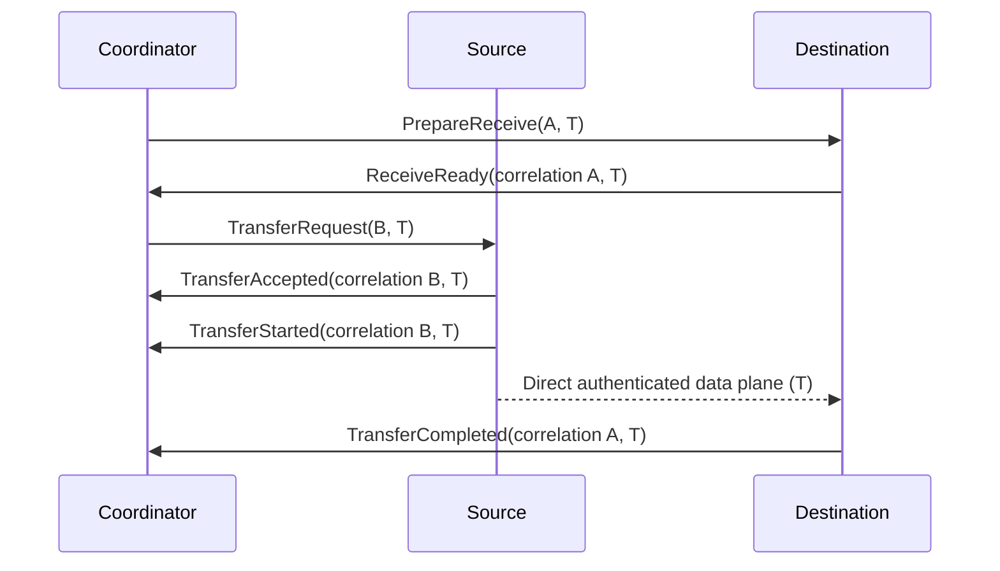

# Protocol contract — wire version 1

## Scope and dependency direction

This package defines the control language for a same-LAN Python runtime. It
implements typed immutable messages, structural validation, deterministic
serialization/deserialization, exact version handling, and incremental framing.
Production uses Python's standard library and the existing execution/scheduler
contracts. Dependency direction is `protocol → scheduler → execution →
dag_runtime`; the lower packages do not import protocol. Imports do not analyze
programs, open resources, create threads, start processes, or contact a network.
Local schema-table initialization is the only registration work on import.

**No user code is deserialized or executed.** The protocol package itself still
opens no sockets and performs no cryptography. Batch 1 adds typed authentication
handshake records (`AuthenticationRequest`, `AuthenticationChallenge`,
`AuthenticationProof`, `AuthenticationAccepted`) so the networking layer can use
the same deterministic codec/framing before worker admission. Actual HMAC/TLS
security remains in `runtime_security` + `networking`, not in this codec.
Batch 2 also adds bounded package-transfer records used by the networking/worker
adapters. Batch 3 adds only the control-language pieces required to retire real
contexts and authorize/cancel a direct worker-to-worker transfer: `ReleaseContext`,
`CancelTransfer`, and source/destination session plus transfer-authorization fields
on `PrepareReceive`/`TransferRequest`. The protocol package itself still does not
build/install packages, start task/context processes, deserialize executable
Python objects, open TLS sockets, or move runtime payload bytes.

The coordinator remains control-plane only. Workers prepare programs/contexts and
perform computation. Runtime object bytes are moved directly between workers by
the worker data-plane implementation; those bytes are deliberately outside this
JSON control protocol.

## Public API

`protocol.__all__` deliberately exports message and DTO classes, protocol enums,
limits, errors, `MESSAGE_TYPES`, `encode_message`, `decode_message`,
`frame_payload`, `FrameDecoder`, `validate_version`, and `negotiate_version`.
Existing types are imported from `execution` or `scheduler`, not renamed or
reimplemented here. `messages.SCHEMAS` and codec registration functions are
internal; applications must not extend or replace them at runtime.

`encode_message(message) -> bytes` accepts only exact registered message classes.
`decode_message(payload: bytes) -> Message` reconstructs only the explicit local
allowlist. Parent records such as `TaskSuccess` cannot be encoded standalone;
they must be placed in a typed message envelope. No Python class name or type
annotation from the wire controls construction. The abstract `Message` base and
user subclasses are not registered wire messages.

Message and protocol DTO dataclasses are frozen with slots. Nested parent types
retain their existing frozen representation. Tuples and frozensets are required
at protocol boundaries; lists, generators, dicts, and arbitrary objects do not
become typed records by implicit coercion. Parent models may have already
normalized inputs when their own constructors were called; the protocol checks
their actual stored fields again. Encoding revalidates records even if a local
caller deliberately bypassed Python's frozen-dataclass protection.

## Framing and stream state

| Bytes | Meaning |
| --- | --- |
| 0–3 | Unsigned 32-bit payload length, network order (big endian) |
| 4 through 4 + length − 1 | Exactly that many UTF-8 JSON payload bytes |

The header excludes itself from the length. Zero length is forbidden. The
absolute payload maximum is **1,048,576 bytes (1 MiB)**. `frame_payload` and
`FrameDecoder` can take a smaller `max_payload`; neither can raise the absolute
limit. A decoder rejects an oversized declaration immediately when the fourth
header byte arrives, before storing any body. It does not reserve or allocate
the declared size in advance. Only bytes actually received are accumulated.

`feed(chunk)` consumes bytes synchronously and returns a list of completed
payloads. It accepts bytes, bytearray, or contiguous one-dimensional byte
memoryviews; it retains no caller-owned view. Empty input is a no-op while open.
Partial headers, partial bodies, concatenated frames, and arbitrary fragmentation
are supported. Consumed payloads never contain a following frame's bytes.
Header storage is at most four bytes; incomplete body storage is bounded by the
configured maximum. Bytearray growth is amortized; there is no repeated copying
of the entire pending body on each byte feed. Total work is linear in received
bytes plus frame count. Returned completed payloads are caller-owned and consume
space proportional to the supplied chunk; applications should bound recv chunk
sizes and downstream queues separately.

The decoder has open, failed, and closed states:

- A malformed frame poisons the decoder, discards incomplete state, and raises
  `FramingError` or `FrameTooLarge`. **`error.completed_frames` is the immutable
  tuple of valid prefix payloads completed during that failed `feed` call.**
  They were not returned elsewhere and can be processed exactly once. Bytes
  after the invalid header are discarded; there is no heuristic resynchronization.
- `finish()` signals EOF. A partial header or body raises `TruncatedFrame` and
  poisons the decoder. Clean EOF closes it; repeated clean `finish()` is harmless.
- Feeding a closed or failed decoder raises `DecoderStateError`, even for an
  empty chunk. `reset()` explicitly abandons all old state and starts a **new
  stream**; it must not be used to guess an offset in a corrupt connection.
- Wrong local input types/released views are caller errors. They raise
  `FramingError` without consuming bytes or poisoning otherwise valid state.

All framing exceptions expose `completed_frames` (empty unless a feed failed
after completing a prefix). No previous error is retained by the decoder.

```python
from protocol import FramingError

try:
    payloads = decoder.feed(chunk)
except FramingError as error:
    payloads = list(error.completed_frames)
    # These are the already completed prefix. Retire the corrupt connection.
```

Framing does not parse JSON. A frame containing invalid JSON is still a complete
frame; `decode_message` independently rejects its payload. Framing state remains
structurally valid, but a connection owner should terminate the offending connection
after malformed protocol input. That lifecycle policy is not hidden in the
codec. Instances are single-owner stateful parsers, without thread safety,
timeouts, rate limiting, socket backpressure, or delivery acknowledgements.

## JSON and deterministic encoding

Control payloads are UTF-8 JSON objects. Encoding uses sorted object keys,
compact separators, `ensure_ascii=False`, and `allow_nan=False`. JSON escapes
control characters in text. Unicode scalar values are preserved exactly, with
no Unicode normalization. Surrogates and invalid UTF-8 are rejected, including
surrogates introduced by JSON escapes. Valid escaped surrogate pairs decode to
their Unicode scalar. A BOM, trailing garbage, invalid syntax, duplicate keys
(including escape-equivalent keys), and non-object envelopes are rejected.

All schema fields, including optional fields, are present in encoded JSON.
Optional means a field can be `null`, not omitted. An empty permitted tuple or
frozenset is an empty array. Order-bearing tuples preserve order; frozensets are
sorted by their primitive wire values. CPU utilization is the sole floating
field: accepted int/float numbers encode as a finite float, with zero normalized
to `0.0`. Thus equal records using `0`, `-0.0`, or `0.0` encode identically.
Booleans are never accepted as integers. Numeric strings and other types are
never coerced. JSON integers use signed 64-bit bounds; count fields further
require non-negative values. Floating values use Python's binary64 float model;
overflow/non-finite values are rejected. This is deterministic for supported
Python runtimes, not a claim of RFC 8785/JCS compatibility or a signature format.

Decoding accepts insignificant whitespace, different key order, and equivalent
valid JSON escapes. Re-encoding produces the canonical local form. No codec
inserts timestamps, random IDs, environment-dependent reprs, or metadata.
ProgramIdentity's existing deterministic content hash is recomputed and verified;
this is not allocation of a new runtime identity.

## Envelope, versioning, and correlation

Every message has exactly these five fields:

```json
{"correlation_id":"dispatch-1","message_id":"started-1","message_type":"task.started","payload":{"attempt":{"attempt_id":"attempt-1","plan_id":"aaaaaaaaaaaaaaaaaaaaaaaaaaaaaaaaaaaaaaaaaaaaaaaaaaaaaaaaaaaaaaaa","run_id":"run-1","task_id":"T000001"},"worker_id":"worker-1"},"protocol_version":1}
```

All objects, at every nesting level, reject unknown and missing fields. There
is no extension dictionary or peer-selected type import. Field errors include a
schema path, without echoing arbitrary raw peer data. Stable wire type strings
are explicit literals in one frozen registry. Duplicate types/classes are a
local `RegistryError`, and an unknown peer type is `UnknownMessageType`.

`PROTOCOL_VERSION = 1`, `SUPPORTED_VERSIONS = (1,)`. Versions are exact positive
integers up to 65535, unrelated to Python or package versions. Zero is reserved
and invalid. Valid-but-unsupported version numbers raise
`UnsupportedProtocolVersion`; malformed versions raise `ValidationError`.
Envelope version checking precedes message-type selection, after JSON structure
and envelope checks. There is no per-call switch to bypass version validation.

`WorkerHello.supported_versions` is a nonempty, duplicate-free tuple of at most
32 positive version numbers and must include its envelope version.
`negotiate_version(peer_versions)` selects the highest intersection with the
local supported versions, or raises `UnsupportedProtocolVersion`. It does not
change codec state or accept other schemas. Hello itself must use a mutually
understood envelope (v1 in this implementation). A peer sending an unknown
envelope cannot bootstrap itself through decoder permissiveness. WorkerAccepted
carries a supported `selected_version`; the networking layer binds it to the
admitted session. The protocol records remain stateless: the authentication and
worker-admission sequence is enforced by `networking`, not by codec-global state.

IDs are opaque, case-sensitive text except existing content identities. They are
not interpreted as integers, UUIDs, paths, Python expressions, or task order.
Callers assign message/session/revision/run/attempt/transfer IDs and heartbeat
sequences. The networking/coordinator ownership layers correlate replies, stale
connections, and authenticated session ownership. Message receipt alone does not
provide exactly-once delivery.

Commands and unsolicited notices require `correlation_id=None`. Every response
or continuation event requires the originating command's `message_id`. It does
not point to the immediately preceding event. In particular, accepted/started/
succeeded/failed task events reference the dispatch; cancellation results refer
to the cancellation request. Source-originated transfer events refer to the
source's `TransferRequest`; destination-originated transfer events refer to the
destination's `PrepareReceive`. A reporter must have actually received the
command named by its correlation ID. The source-only request ID is never a
requirement of destination completion or failure.
ErrorReport may have a correlation ID or None when no valid incoming ID exists.
A message cannot correlate to its own message ID. These rules validate local
structure only; matching a response's complete identity to an outstanding
command remains the future caller's responsibility.

## Identity and parent records

| Record | Wire representation and invariant |
| --- | --- |
| `ProgramIdentity` | `source_sha256`, `filename`, `environment_id`, nullable `package_id`, and computed `id`; the original constructor recomputes and verifies `id` |
| `AttemptIdentity` | Exact `plan_id`, `run_id`, `task_id`, `attempt_id`; no field is dropped or inferred |
| `FailureInfo` | Exact `kind`, `message`, nullable `exception_type`, nullable `traceback_text`; Python exception kind requires a nonempty type name |
| `TaskSuccess` | Existing `attempt` plus unique tuple `output_ids`; logical acknowledgements only |
| `TaskFailure` | Existing `attempt` plus `failure`; never successful outputs |
| `WorkerState` | Every stored field is retained: worker ID, slot counters, online/accepting flags, CPU/RAM/core facts, environment/program/mode sets |
| `WorkerContext` | Exact context owner, prepared task-ID set and available entry slots; enclosing message provides plan/run |
| `WorkerEndpoint` | Worker ID, opaque nonempty host text, integer port 1–65535; no DNS lookup or socket activity |
| `DataReference` | Plan/run, value ID, existing `DataForm`, nullable object-state ID; representation key only |
| `TransferIdentity` | DataReference, transfer ID, transfer-attempt ID, source worker, destination worker; distinct endpoints |

The existing lowercase 64-hex SHA-256 requirement is retained for source,
program, and plan identities. Environment/package identities remain distinct
opaque strings. Program identity binds source, filename, environment, and package;
it is not an installation claim or authentication proof. The protocol does not
invent the source filename's filesystem meaning.

Worker claims are structurally checked, including running + reserved <= total
slots, available <= total memory, CPU in 0–100, and supported-mode enums. These
are internal record invariants, not a resource-admission decision or proof of
capacity. All counters include other plans as established by WorkerState.
Empty preparation and supported-mode sets remain empty; nothing is inferred.

The initial design assumes cluster membership is supplied by the coordinator.
Hello introduces a known worker and its claimed endpoint; it does not pair,
discover, authenticate, enroll, or prove that worker's identity. WorkerAccepted
and MembershipUpdate distribute explicit membership views. Duplicate worker
IDs are prohibited within one view. Membership revision ordering and the truth
of any claim are future coordinator responsibilities.

## Messages

The field lists below are payload fields. All messages also carry the envelope
fields above. `?` means nullable on the wire; even nullable/defaulted fields are
required in wire JSON. Defaults apply only to Python constructors. The Python
class declarations and closed schemas specify exact nested types and defaults.

| Wire type / Python class | Payload fields | Correlation | Meaning |
| --- | --- | --- | --- |
| `worker.hello` / `WorkerHello` | `worker`, `endpoint`, `supported_versions` | none | Worker introduction and claimed resources/modes/programs plus endpoint/version offers. |
| `worker.accepted` / `WorkerAccepted` | `worker_id`, `session_id`, `selected_version`, `members` | required | Coordinator reports admission, session/version and current member endpoints. |
| `worker.rejected` / `WorkerRejected` | `worker_id`, `code`, `detail` | required | Coordinator declines introduction with structured reason. |
| `worker.membership` / `MembershipUpdate` | `worker_id`, `session_id`, `revision`, `members` | none | Coordinator sends a full revised membership view for the admitted session. |
| `worker.heartbeat` / `Heartbeat` | `worker`, `sequence` | none | Worker reports explicit sequence and complete current WorkerState claims. |
| `worker.heartbeat_ack` / `HeartbeatAck` | `worker_id`, `sequence` | required | Coordinator acknowledges the originating heartbeat and sequence. |
| `worker.goodbye` / `WorkerGoodbye` | `worker_id`, `reason` | none | Worker announces disconnect intent; no implicit task outcome. |
| `program.prepare` / `PrepareProgram` | `worker_id`, `plan_id`, `program` | none | Request preparation of the exact program/plan reference. |
| `program.prepared` / `ProgramPrepared` | `worker_id`, `plan_id`, `program_id` | required | Worker reports exact program/plan prepared. |
| `program.preparation_failed` / `ProgramPreparationFailed` | `worker_id`, `plan_id`, `program_id`, `failure` | required | Worker reports preparation failure, with inert FailureInfo. |
| `program.unavailable` / `ProgramUnavailable` | `worker_id`, `program_id`, `reason` | none | Worker withdraws a prepared-program claim, e.g. eviction. |
| `package.start` / `PackageTransferStart` | `worker_id`, `plan_id`, `program_id`, `package_id`, `size_bytes`, `archive_sha256` | required | Begin one bounded package delivery correlated to the exact `PrepareProgram`. |
| `package.chunk` / `PackageTransferChunk` | `worker_id`, `package_id`, `offset`, `data_hex` | required | Ordered bounded package bytes for that preparation. |
| `package.end` / `PackageTransferEnd` | `worker_id`, `package_id`, `size_bytes`, `archive_sha256` | required | End marker repeating exact package byte length/hash; not a preparation-success claim. |
| `context.prepare` / `PrepareContext` | `worker_id`, `plan_id`, `run_id`, `program_id`, `context_id`, `task_ids` | none | Request native-context preparation for exact plan/run/tasks. |
| `context.prepared` / `ContextPrepared` | `plan_id`, `run_id`, `context` | required | Worker reports the scoped WorkerContext and prepared task set. |
| `context.preparation_failed` / `ContextPreparationFailed` | `worker_id`, `plan_id`, `run_id`, `context_id`, `failure` | required | Worker reports scoped context-preparation failure. |
| `context.unavailable` / `ContextUnavailable` | `worker_id`, `plan_id`, `run_id`, `context_id`, `reason` | none | Worker reports loss of a scoped native context. |
| `task.dispatch` / `TaskDispatch` | `worker_id`, `attempt`, `program_id`, `mode`, `context_id?` | none | Request one caller-assigned attempt in an exact mode/context. |
| `task.accepted` / `TaskAccepted` | `worker_id`, `attempt` | required | Worker accepts that dispatch attempt; no commit. |
| `task.rejected` / `TaskRejected` | `worker_id`, `attempt`, `code`, `detail` | required | Worker rejects dispatch with reason; no invented execution failure. |
| `task.started` / `TaskStarted` | `worker_id`, `attempt` | required | Worker reports attempt start; not completion. |
| `task.succeeded` / `TaskSucceeded` | `worker_id`, `result` | required | Worker reports existing TaskSuccess logical output acknowledgements. |
| `task.failed` / `TaskFailed` | `worker_id`, `result` | required | Worker reports existing TaskFailure; never successful outputs. |
| `task.cancel` / `CancelTask` | `worker_id`, `attempt`, `reason` | none | Request cancellation of one exact attempt. |
| `task.cancellation_result` / `TaskCancellationResult` | `worker_id`, `attempt`, `outcome`, `detail` | required | Worker reports cancellation outcome; no rollback guarantee. |
| `object.available` / `ObjectAvailable` | `worker_id`, `data`, `size_bytes?` | none | Worker claims possession of an exact transferable representation. |
| `object.unavailable` / `ObjectUnavailable` | `worker_id`, `data`, `reason` | none | Worker reports loss/eviction of that representation. |
| `object.release` / `ReleaseObject` | `worker_id`, `data`, `reason` | none | Coordinator requests release of that representation. |
| `object.released` / `ObjectReleased` | `worker_id`, `data` | required | Worker acknowledges release request. |
| `transfer.prepare_receive` / `PrepareReceive` | `transfer`, `size_bytes?` | none | Coordinator asks the destination to prepare this exact transfer attempt; optional size is expected representation metadata. |
| `transfer.receive_ready` / `ReceiveReady` | `worker_id`, `transfer` | required | Destination acknowledges its PrepareReceive and is ready for the incoming transfer. |
| `transfer.receive_preparation_failed` / `ReceivePreparationFailed` | `worker_id`, `transfer`, `code`, `detail` | required | Destination reports failure to prepare, correlating to PrepareReceive; no source instruction is needed. |
| `transfer.request` / `TransferRequest` | `transfer`, `destination` | none | Coordinator instructs the source after matching destination readiness. |
| `transfer.accepted` / `TransferAccepted` | `worker_id`, `transfer` | required | Source acknowledges the transfer request. |
| `transfer.started` / `TransferStarted` | `worker_id`, `transfer` | required | Source reports transfer start. |
| `transfer.completed` / `TransferCompleted` | `worker_id`, `transfer`, `size_bytes?` | required | Destination confirms validated receipt, correlating to PrepareReceive. |
| `transfer.failed` / `TransferFailed` | `worker_id`, `transfer`, `code`, `detail` | required | Source correlates to TransferRequest; destination correlates to PrepareReceive after readiness. |
| `protocol.error` / `ErrorReport` | `code`, `detail` | optional | Peer reports a protocol issue, distinct from TaskFailure. |

## Preparation and task lifecycle

PrepareProgram references an exact plan and full ProgramIdentity. ProgramPrepared
reports both plan and program identity; prepared-program advertisements alone
do not reconstruct or prove a particular plan. ProgramUnavailable withdraws
that program's preparation claim. In Batch 2 the networking adapter may follow a
PrepareProgram with PackageTransferStart/Chunk/End. Those records carry only a
bounded content-addressed package archive and are correlated to the exact
PrepareProgram; `PackageTransferEnd` does **not** assert that the package is
usable. The worker must verify/install the package, verify source/program
identity, reconstruct the execution plan locally, match the requested plan
digest, and only then report ProgramPrepared. **The protocol deliberately
carries plan references, not serialized ExecutionPlan/TaskManifest graphs.** A
filename/callable name or a matching environment alone is insufficient.

PrepareContext additionally scopes native context setup by plan/run/context and
exact task-ID tuple. ContextPrepared returns the existing WorkerContext. Neither
message certifies readiness. A future adapter must preserve original bindings,
definition versions, native scope/frame semantics, alias lifetime, and state
versions. This phase does not create or restore a native context.

TaskDispatch uses the existing complete AttemptIdentity, explicit program ID,
ExecutionMode, worker and optional exact context ID. SHARED_CONTEXT/NATIVE_REGION
require a context ID, preserving the existing contract; ISOLATED_CANDIDATE may
also carry a context restriction. The protocol never promotes a mode, schedules
a task, verifies a manifest against a plan, reserves capacity, or generates an
attempt. A future worker matches the command against its prepared plan and
resources and can send TaskAccepted or TaskRejected. Receipt/acceptance does
not make a scheduler proposal an executed task.

TaskSucceeded preserves TaskSuccess exactly. Output IDs acknowledge the
manifest's reported outputs, including state/native-view IDs where applicable.
They contain no result bytes and do not claim all possible native bindings are
bound. **Protocol success does not mean DAG commitment.** The coordinator must
validate the expected attempt and outputs against the original plan and apply
required source-ordered binding/state commits before advancing readiness.

TaskFailed preserves FailureInfo text and kind, not live exception objects or
traceback frames. Its receipt does not retry, roll back, or unlock dependents.
TaskCancellationResult similarly describes an outcome: cancelled, too late,
not found, or unsupported. Cancelled does not promise rollback of native partial
effects. Late events remain distinguishable by plan/run/task/attempt identity.
No deduplication, timeout, transition validation, or retry policy is embedded.

## Location and transfer control

DataReference uses only the existing scheduler DataForm values:

| Execution concept | Control representation |
| --- | --- |
| Immutable value | `DataForm.IMMUTABLE_VALUE`, no object-state version |
| Certified shared-reference snapshot | `DataForm.OBJECT_SNAPSHOT`, exact object-state ID or None for initial producer-established version |
| Namespace/completion/object-state token itself | Semantic prerequisite/acknowledgement; no transferable DataForm |
| Native reference | Native prepared context; no ordinary object serialization |
| Code binding | Exact prepared program/definition context; no value payload |
| Discarded result | No retained transferable representation |

DataReference includes `value_id` (already versioned by the DAG) and
`object_state_id`. Object group identity is obtained from the referenced plan;
there is no weaker duplicate object-identity model. None is **not latest**.
Source/destination worker IDs, transfer ID, and transfer-attempt ID prevent
mixing two routes or retries for the same plan/run/value/version.

`DataReference.from_location(plan_id, run_id, location)` checks the typed parent
DataLocation and copies its key. `to_location(replicas, size_bytes)` copies that
key back, with explicitly supplied typed Replica metadata and optional size.
This is lossless for the key; replicas and size are separate metadata and must
be preserved by the caller. The receiving ClusterSnapshot must match the
reference's plan/run; DataLocation itself has no plan/run fields. Unknown size
stays None, distinct from zero. AVAILABLE and IN_FLIGHT remain distinct.

Neither protocol nor DataForm can determine a value's true kind from an opaque
ID alone. A malicious peer can claim an arbitrary ID is immutable; only the
existing plan-aware `ClusterSnapshot.validate(plan)` or future coordinator can
refute it. A valid packet is never a certification that a snapshot is safe to
copy, exists, is current, belongs to the claimed object, or has committed.
Existing scheduler validation remains authoritative; it is not recreated here.

ObjectAvailable/Unavailable are worker claims about one exact representation;
ReleaseObject requests removal and ObjectReleased acknowledges it. Availability
does not commit a producing task or grant object ownership/retry permission.

### Destination preparation and transfer identity

Destination preparation fixes an information gap: a destination cannot be
required to correlate a report to a command sent only to the source. The
coordinator therefore sends `PrepareReceive` to the destination **first**. It
carries the existing complete `TransferIdentity` and optional expected
`size_bytes`, using the existing representation-size convention (None means
unknown, zero is known empty). There is no new checksum format, object serializer,
or payload field. The command identifies the source/destination and exact
plan/run/value/form/object-state version through the existing nested identity.

`transfer_id` identifies the caller/coordinator-assigned logical operation within
its plan/run. `transfer_attempt_id` distinguishes attempts of that operation.
Both remain unchanged across destination preparation, readiness, source
instruction/acceptance/start, and completion/failure. Neither is generated or
derived from control-message IDs. `message_id` identifies one message; a
`correlation_id` identifies the command actually delivered to that reporter.
These two control-channel legs share a TransferIdentity, not a request ID.

Callers must match the **complete** TransferIdentity, including data and
route. The plan/run/transfer/transfer-attempt tuple can identify a lookup, but a
different value/version or route under that same key is a conflicting claim,
not an automatic replacement. Concurrent transfers of the same value to two
destinations use distinct logical transfer IDs. Old attempts, runs, or versions
are not equivalent to the new attempt merely because a transfer ID matches.
The stateless schema rejects malformed IDs, duplicate JSON keys, foreign
reporter fields, and equal source/destination, but cannot know global ID
ownership or an outstanding request's metadata. The coordinator must reject those cross-message collisions. The protocol package
contains no global registry of live transfers, deduplication, retry allocation,
or state-machine engine; those remain coordinator responsibilities.

### Successful control sequence

In this diagram A and B are distinct control-message IDs and T denotes the
same complete TransferIdentity throughout:



The destination responds with ReceiveReady only after preparing receipt for
that exact transfer attempt. The coordinator waits for that matching readiness
before sending TransferRequest. TransferRequest retains its existing shape and
destination endpoint; its endpoint worker ID must match TransferIdentity.
Acceptance and start are source reports, not destination possession.

TransferCompleted remains authoritative from the **destination**, after the
receiver has received, integrity-checked, and atomically published the representation. It correlates
to PrepareReceive (A), which the destination actually received. The destination
never depends on the source-only TransferRequest ID (B), and the data plane
does not need to forward B. Destination failure uses A for the same reason.
The protocol defines these reports but does not perform receipt validation or
commit location metadata. The Batch-3 worker data plane performs physical receipt
validation; the coordinator still validates the report against its authoritative
transfer state. Completion does not imply task/DAG commitment.

### Sender, recipient, and correlation audit

| Message | Sender → recipient | `correlation_id` | Semantic identity |
| --- | --- | --- | --- |
| PrepareReceive | Coordinator → destination | None | Complete TransferIdentity T |
| ReceiveReady | Destination → coordinator | Its PrepareReceive.message_id (A) | Same T |
| ReceivePreparationFailed | Destination → coordinator | Its PrepareReceive.message_id (A) | Same T |
| TransferRequest | Coordinator → source | None | Same T, after readiness |
| TransferAccepted | Source → coordinator | Its TransferRequest.message_id (B) | Same T |
| TransferStarted | Source → coordinator | Its TransferRequest.message_id (B) | Same T |
| TransferCompleted | Destination → coordinator | Its PrepareReceive.message_id (A) | Same T |
| TransferFailed, source worker_id | Source → coordinator | Its TransferRequest.message_id (B) | Same T |
| TransferFailed, destination worker_id | Destination → coordinator | Its PrepareReceive.message_id (A) | Same T |

ReceiveReady and ReceivePreparationFailed require the destination worker ID.
Existing sender validation for accepted/started/completed/failed remains intact.
TransferFailed remains a single message: worker_id unambiguously identifies
source versus destination because the two participants must differ. Failure
origin is not inferred from free text or the error code.

### Conceptual lifecycle and failures

The conceptual path is CREATED → DESTINATION_PREPARING → DESTINATION_READY →
SOURCE_INSTRUCTED → SOURCE_ACCEPTED → TRANSFER_IN_PROGRESS →
DESTINATION_CONFIRMED → COMPLETE. These are explanatory states, not new runtime
enums or an executable transition engine. COMPLETE includes the future
coordinator's validation/metadata decision, not an automatic action by the codec.

- During DESTINATION_PREPARING, ReceivePreparationFailed reports inability to
  prepare, using the existing TransferFailureCode and bounded detail. No source
  send command is required or justified by that failure.
- After ReceiveReady, a destination that can no longer receive reports
  TransferFailed with its worker ID and correlation A, even if source instruction
  has not yet happened. Readiness is a scoped observation, not a permanent
  guarantee. The coordinator must handle racing/later failures.
- A source can reject its instruction before acceptance/start using TransferFailed
  with correlation B, for example DATA_UNAVAILABLE or VERSION_MISMATCH. It can
  also fail after start, for example IO_ERROR or CANCELLED.
- A destination can fail after start using TransferFailed with correlation A,
  for example INTEGRITY_ERROR, IO_ERROR, or CANCELLED. It must not report success
  merely because the source finished sending.

The connection/coordinator owner must check recipient-visible correlation,
matching identity, readiness, and lifecycle order against its outstanding
commands. A codec cannot determine that an otherwise valid opaque correlation
string was never delivered. Tests distinguish local schema rejection from these
explicit cross-message matching obligations; construction of TransferRequest
alone is not evidence that readiness has been established.

### Batch-3 physical data-plane binding

The runtime now implements the byte plane outside this package. For live P2P
transfer, `PrepareReceive` and `TransferRequest` carry an all-or-none tuple of
`source_session_id`, `destination_session_id`, and coordinator-generated
`authorization`. A real worker fails closed if that tuple is absent. The exact
tuple is copied into the authenticated P2P header together with the complete
`TransferIdentity`, declared size, SHA-256 and serialization label. TLS peer
certificate identity must match the expected source/destination worker.

The destination accepts a socket only after a matching prepared receive exists and
a complete identity/session/token comparison succeeds. Payload bytes are streamed
in bounded chunks into temporary storage, checked for exact length and digest, and
atomically published before `TransferCompleted` is sent. `CancelTransfer` is an
idempotent physical-cleanup command for the exact attempt; participant cleanup is
reported with the original preparation/request correlation. A stale session,
transfer attempt, data reference, or object-state version cannot satisfy a newer
operation.

These physical rules do not change logical retry policy. Transfer retry is not
task retry, failures do not imply rollback of arbitrary user side effects, and
physical exactly-once execution is not claimed. Location commitment and logical
task authority remain coordinator responsibilities.

## Resource limits

| Budget | Wire-v1 limit |
| --- | --- |
| Payload | 1,048,576 bytes; outgoing aggregate size checked incrementally |
| Identifier/host | 256 UTF-8 bytes; nonblank; rejects C0/C1 controls and DEL |
| Filename/exception type metadata | 4,096 UTF-8 bytes; nonblank |
| Reason/detail/failure message | 8,192 UTF-8 bytes; empty allowed |
| Traceback text / any parsed JSON string | 65,536 UTF-8 bytes; empty allowed |
| Collection | 4,096 entries; field rules may be stricter |
| Object fields | 64 maximum before schema validation |
| JSON nesting | 32 container levels |
| JSON structural nodes | 65,536 lexical node starts, including keys/containers |
| Numeric token | 64 characters |
| Integers | Signed 64-bit JSON; protocol counts 0 through 2^63 − 1 |
| Slots/cores/context entries | Up to 1,000,000; cores at least one |
| Port | 1–65535 |
| Version offers | 1–32 unique positive versions, each <=65535 |

A linear lexical guard checks nesting, container width, and node budgets before
the JSON parser builds a tree. The total byte bound applies first. Strings are
then checked for valid Unicode and global size before schema conversion; field
bounds apply at construction and decoding. Duplicate keys and non-finite/huge
numeric tokens are rejected through explicit JSON parser hooks. The schema is
itself fixed and bounded. Error strings do not copy the hostile payload.

Bounds limit one call/frame, not an unlimited number of messages over time.
Future transport owners must supply stream timeouts, connection limits, queue
limits, backpressure, and authentication. A peer can hold a partial allowed
frame indefinitely until the caller chooses to finish/terminate the stream.

## Error model and malformed input

| Local exception | Meaning |
| --- | --- |
| `ProtocolError` | Base class for all protocol failures |
| `EncodingError` | Unsupported local message/object |
| `DecodingError` | Invalid bytes, UTF-8, JSON, or envelope |
| `ValidationError` | Known schema has invalid fields; subclass of both encoding/decoding errors |
| `ResourceLimitExceeded` | Text, collection, numeric, aggregate-payload or structural budget |
| `UnsupportedProtocolVersion` | Structurally valid but unsupported version/no common version |
| `UnknownMessageType` | Unknown stable wire type |
| `RegistryError` | Invalid/duplicate local registration |
| `FramingError` | Invalid frame header or local framing argument |
| `FrameTooLarge` | Payload/declared length over framing limit |
| `TruncatedFrame` | EOF during header/body |
| `DecoderStateError` | Feed/use after failed or closed state |

Validation/resource/version errors derive from ValidationError as appropriate;
framing specializations derive from FramingError. Parent model construction
errors are deliberately converted to ValidationError at the decode boundary.
Error classes, field paths, and wire enums are intended for stable handling;
applications should not branch on English wording.

The peer-visible `ErrorReport` is a frozen message with `ProtocolErrorCode` and
bounded detail, deliberately named differently from the exception base. Its
codes include unsupported version, malformed message, unknown type, invalid
field/schema, oversized frame, and resource limit. The caller decides whether
it is possible/useful to report an error; the codec never emits a reply, echoes
untrusted payloads automatically, or translates a protocol failure into a user
task failure. Malformed input never returns a partially populated message.

## Extension strategy and deliberate limitations

This release makes an explicit **pre-deployment correction to wire v1**: it adds
the three receive-preparation message types and corrects transfer correlation
semantics while retaining all existing wire shapes and identifiers. There are
no deployed peers to migrate; version.py and negotiation behavior are unchanged.
An older decoder rejects the new types as unknown. This is not a claim that
mixed old/new peers implement the corrected lifecycle. Subsequent deployed
extensions follow the closed-version rules below.

Wire version 1 is closed. Adding/removing fields, enum values, message types,
different data forms, limits, or incompatible meanings requires an explicit
version design and matching local registry/schema update, plus golden and
negative tests. Do not silently add permissive optional fields or dynamic
registration. Future versions must be individually supported by the decoder
and deliberately negotiated; unknown majors or other unknown versions fail.

The current registry is initialized once and exposed read-only. It constructs
only local approved frozen records. There is no pickle, marshal, eval, exec,
dynamic type import, arbitrary object graph serializer, byte blob transport,
source compilation, network operation, or user callback. Failure traceback text
and code-looking metadata remain inert text; UI/logging layers should escape
control characters when displaying them. No protocol message is an independent
authorization to execute code, install a package, or connect to an endpoint.

This is a control protocol, not a full running cluster. Future adapters must
obtain plans/programs safely, preserve native semantics, validate provenance and
expected attempts, track membership and lifecycle, and commit results. The
existing execution/DAG contracts remain the semantic authority throughout.

## Verification

See [VERIFICATION.md](VERIFICATION.md) for the exact baseline, suite results,
audit, and fresh-extraction verification performed for this deliverable.
Tests cover every registered message, every frame split for every message,
all nested missing/unknown fields, negative types, cross-layer identities,
versioning, resource budgets, seeded byte/chunk mutation, and a 10,000-frame batch.
The benchmark records observations without timing-based test thresholds.
